# Kairo — OrgMind AI

A **local-first, multi-tenant RAG platform** for associations, clubs, NGOs, and small businesses.

Upload internal documents, manage members and permissions, and run a private AI assistant that answers questions with source citations — entirely on your own hardware.

## Architecture

```
┌─────────────────────────────────────────────────────┐
│                   Frontend (Vue 3)                   │
│     apps/web/ — Vite · Pinia · Bootstrap 5           │
│     Login · Dashboard · Admin · Member views         │
└──────────────────┬──────────────────────────────────┘
                   │ HTTP (REST API)
┌──────────────────▼──────────────────────────────────┐
│              Backend (FastAPI / Python)              │
│     services/api/ — Modular monolith                 │
│                                                      │
│  ┌──────────┐ ┌──────────┐ ┌────────────────────┐   │
│  │  Auth &  │ │ Document │ │   Membership &     │   │
│  │ Tenancy  │ │   Mgmt   │ │  Contributions     │   │
│  └──────────┘ └──────────┘ └────────────────────┘   │
│  ┌──────────┐ ┌──────────┐ ┌────────────────────┐   │
│  │ Policies │ │  Events  │ │Chat / RAG + Vector │   │
│  │ & Disc.  │ │ & Ann.   │ │ Search & Retrieval │   │
│  └──────────┘ └──────────┘ └────────────────────┘   │
│                                                      │
│  Provider pattern: LLM · Embeddings · Vector Store   │
└───┬──────┬──────┬──────┬──────┬──────┬──────────────┘
    │      │      │      │      │      │
    ▼      ▼      ▼      ▼      ▼      ▼
┌────┐ ┌────┐ ┌────┐ ┌────┐ ┌────┐ ┌────────────┐
│ PG │ │Redis│ │MinIO│ │Qdrant│ │Celery│ │ Ollama     │
└────┘ └────┘ └────┘ └────┘ └────┘ └────────────┘
  DB    Queue   Storage  Vector  Worker  Local LLM
```

**Key design decisions:**
- **Backend enforces all permissions** — the LLM never decides access control
- **Tenant isolation** on every DB query (every request carries `tenant_id`)
- **RAG retrieval** is filtered by tenant and access scope before the LLM sees anything
- **Provider pattern** — all infrastructure behind interfaces (swap Ollama → OpenAI, Qdrant → Pinecone, etc.)
- **Autonomous tests** default to SQLite — portable on any machine or agentic IDE

## Quick Start

```bash
# 1. Prerequisites
#    - Docker & Docker Compose
#    - Git
#    - ~8 GB free RAM (for Ollama + Qdrant + services)

# 2. Clone and enter the repo
git clone <repo-url> kairo
cd kairo

# 3. Copy environment config
cp .env.example .env

# 4. Start all services (first pull may take a few minutes)
docker compose up --build

# 5. In another terminal, seed demo data
docker compose exec api python -m app.db.seed
```

Optional: add a second tenant for multi-tenant demos

```bash
./seed/seed-multi-tenant.sh
```

On Windows PowerShell:

```powershell
.\seed\seed-multi-tenant.ps1
```

Then access the app:

- Frontend: `http://localhost:5173`
- API docs: `http://localhost:8000/docs`

### Demo Credentials

| Role | Email | Password |
| --- | --- | --- |
| Admin | `admin@demo.org` | `Admin123!` |
| Member | `alice@demo.org` | `Member123!` |
| Member | `bob@demo.org` | `Member123!` |
| Treasurer | `treasurer@demo.org` | `Treasurer123!` |
| Secretary General | `secretary@demo.org` | `Secretary123!` |
| Auditor | `auditor@demo.org` | `Auditor123!` |
| Censor | `censor@demo.org` | `Censor123!` |
| Sports Manager | `sports@demo.org` | `Sports123!` |
| President | `president@demo.org` | `President123!` |
| Vice President | `vice-president@demo.org` | `VicePresident123!` |
| Principal Admin | `principal@demo.org` | `Principal123!` |

## Project Structure

```
kairo/
├── apps/web/            Vue 3 frontend (TypeScript, Pinia, Bootstrap 5)
├── services/api/        FastAPI backend (modular monolith)
│   ├── app/
│   │   ├── modules/     Domain modules (tenancy, identity, documents, chat,
│   │   │                membership, contributions, policies, disciplinary,
│   │   │                events, announcements)
│   │   ├── db/          Session, migrations, seed scripts
│   │   └── core/        Security, logging, provider abstractions
│   └── tests/           181+ integration tests (SQLite, no infra needed)
├── infra/               Infrastructure config samples (nginx, caddy, cloudflare)
├── docs/                Architecture docs, ADRs, sprint notes, deployment guide
├── orgmind_prompt_pack/ Source-of-truth product documentation
├── scripts/             Utility scripts (backup, etc.)
├── seed/                Demo tenant data helpers
├── constitution/        Project constitution and rules
└── prompts/             AI agent startup prompts (Codex, Cursor, Copilot)
```

## Demo Walkthrough

See [`docs/demo-script.md`](docs/demo-script.md) for a complete walkthrough covering:

1. **Admin login** — browse members, manage documents, view policies, configure tenant settings & module toggles
2. **Member login** — view profile, download a personal PDF statement, check balance, and read association updates
3. **RAG chat** — ask questions about bylaws, policies, governance summaries, publication context, and sports or disciplinary role work with cited answers
4. **AI safety** — prompt injection resistance, no-source refusal
5. **Secretary workspace** — manage documents, policies, and announcements without finance powers
6. **Treasurer finance workspace** — review member balances, create contribution records, record payments, and send contribution reminders
7. **Auditor finance oversight** — inspect balances, exports, and payment activity in read-only mode
8. **Censor workspace** — manage disciplinary records inside explicit privacy boundaries
9. **Sports operations workspace** — manage sports events from a dedicated role-scoped surface
10. **Governance cockpit** — review cross-module executive oversight from president and vice president views
11. **Principal admin control plane** — manage tenant-wide settings, access, and high-sensitivity operations
12. **Tenant operations command center** — inspect memberships, review the current tenant posture, and switch context explicitly
13. **Multi-tenant UX** — validate the tenant picker and tenant switcher through the browser gallery harness

## Demo Gallery

The repository includes two reusable browser-driven screenshot packs:

- Seeded full-stack sessions: [`docs/github-demo/sessions/`](docs/github-demo/sessions/)
- Role and tenant gallery: [`docs/github-demo/role-gallery/`](docs/github-demo/role-gallery/)
- Full-stack capture script: [`scripts/capture-github-demo.mjs`](scripts/capture-github-demo.mjs)
- Role-gallery capture script: [`scripts/capture-readme-gallery.mjs`](scripts/capture-readme-gallery.mjs)
- Multi-tenant provisioning helper: [`seed/seed-multi-tenant.sh`](seed/seed-multi-tenant.sh)

The role gallery below is generated from the current application routes and role matrix. It is deterministic and reproducible even when the local demo seed remains single-tenant.

### Public Entry

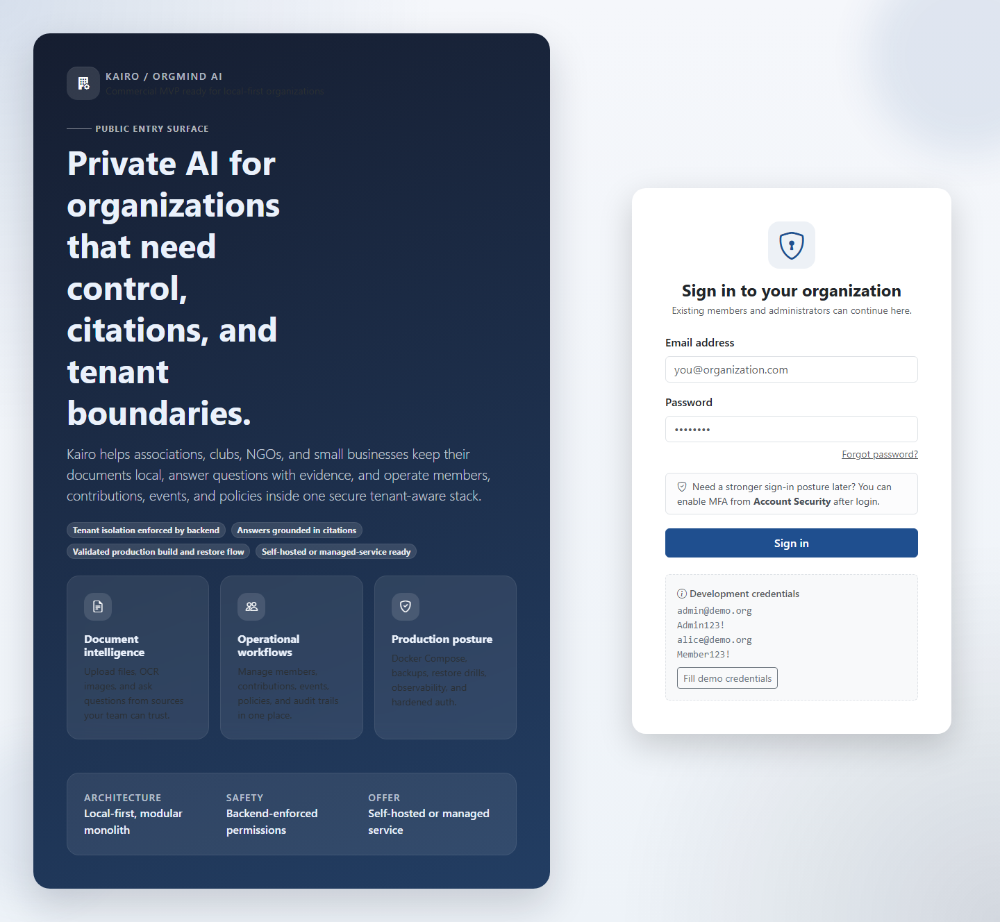

### Tenant Picker

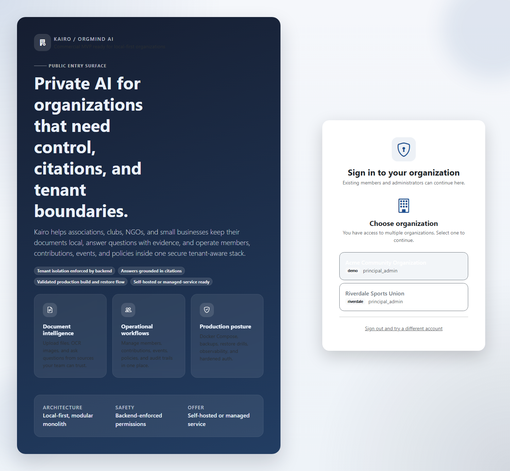

### Member Portal

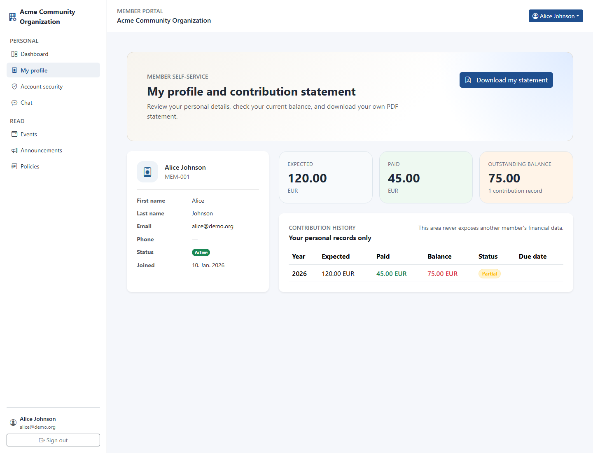

### Secretary General


### Treasurer

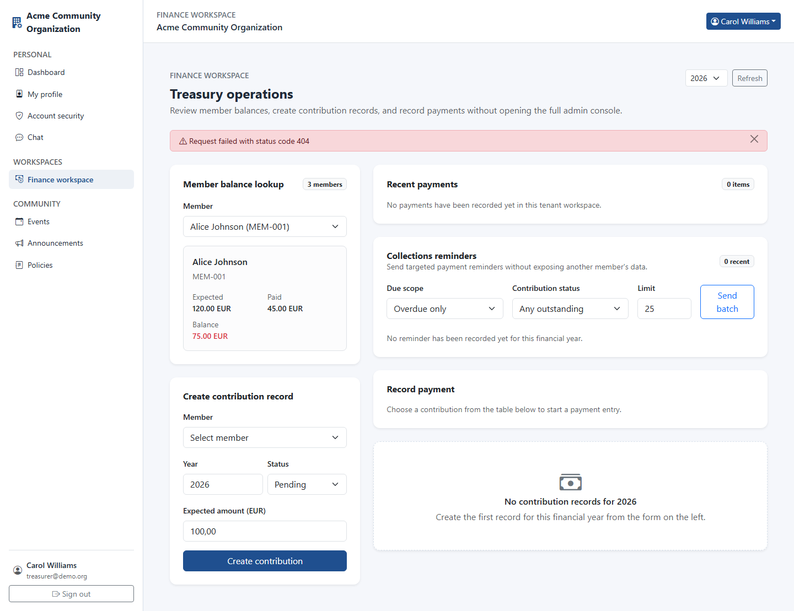

### Auditor

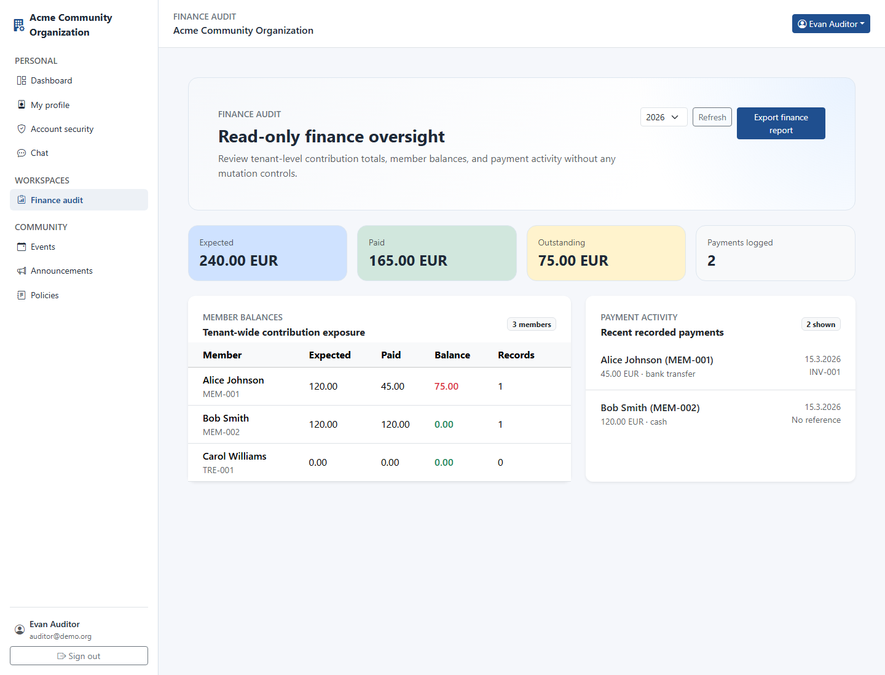

### Censor

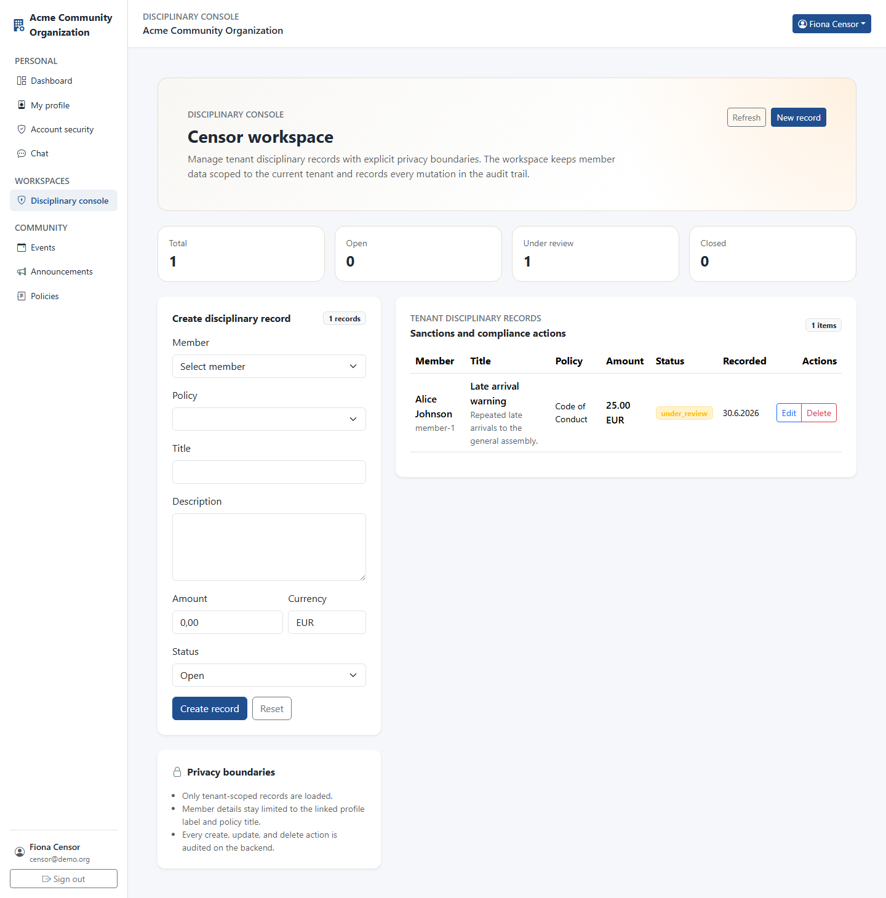

### Sports Manager

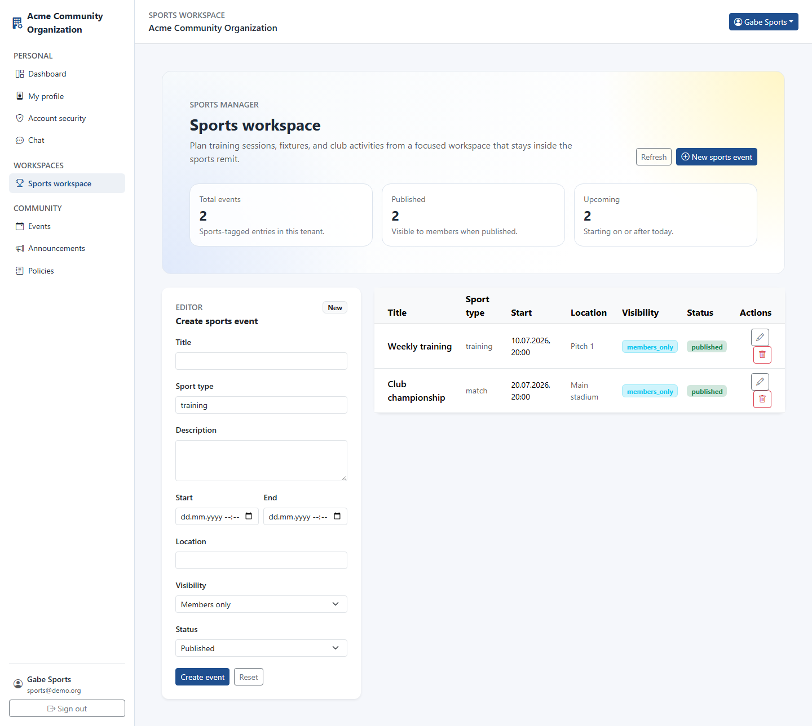

### President

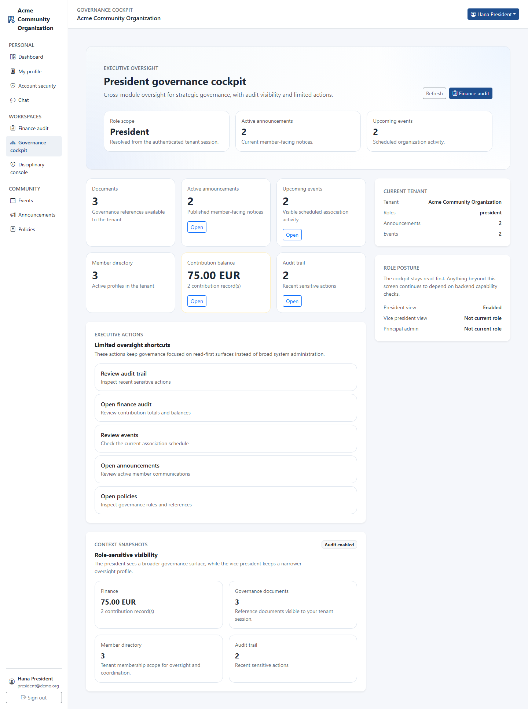

### Vice President

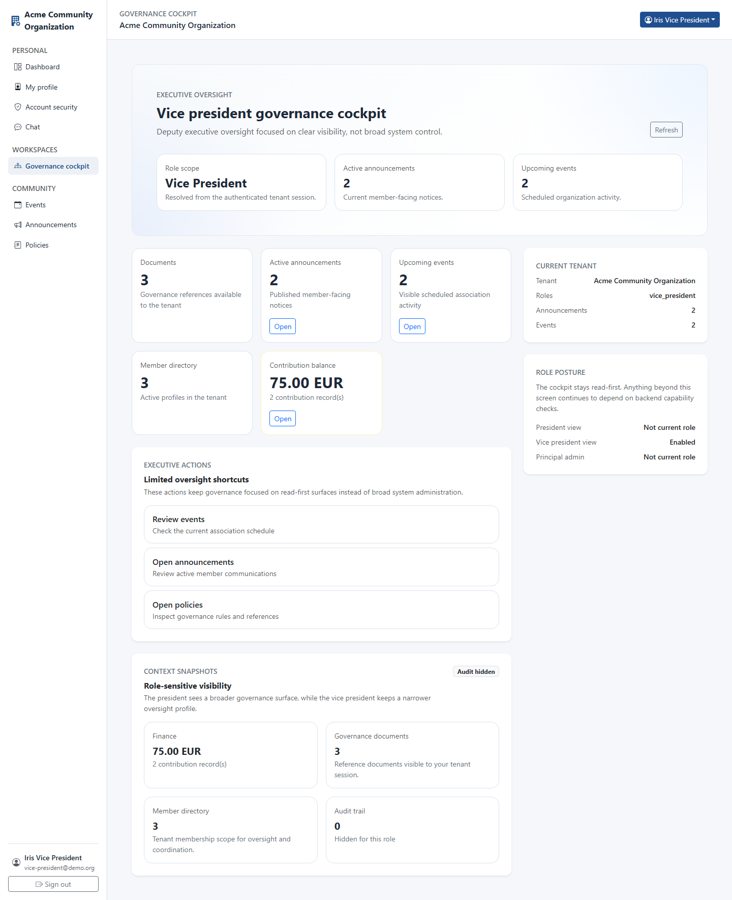

### Principal Admin

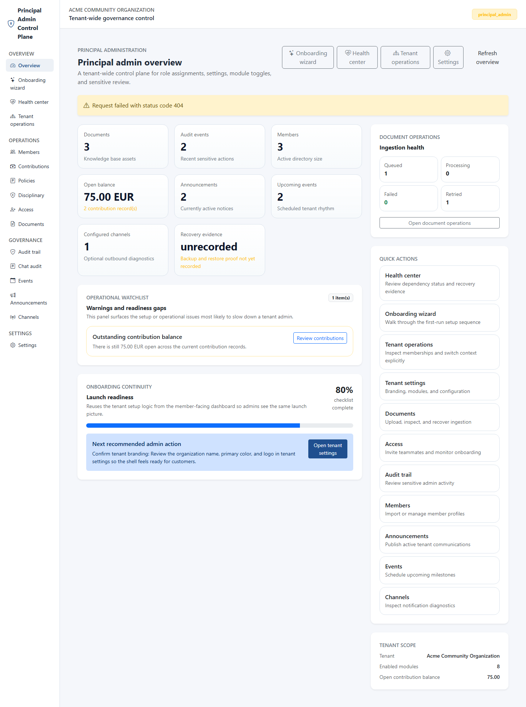

### Tenant Switcher

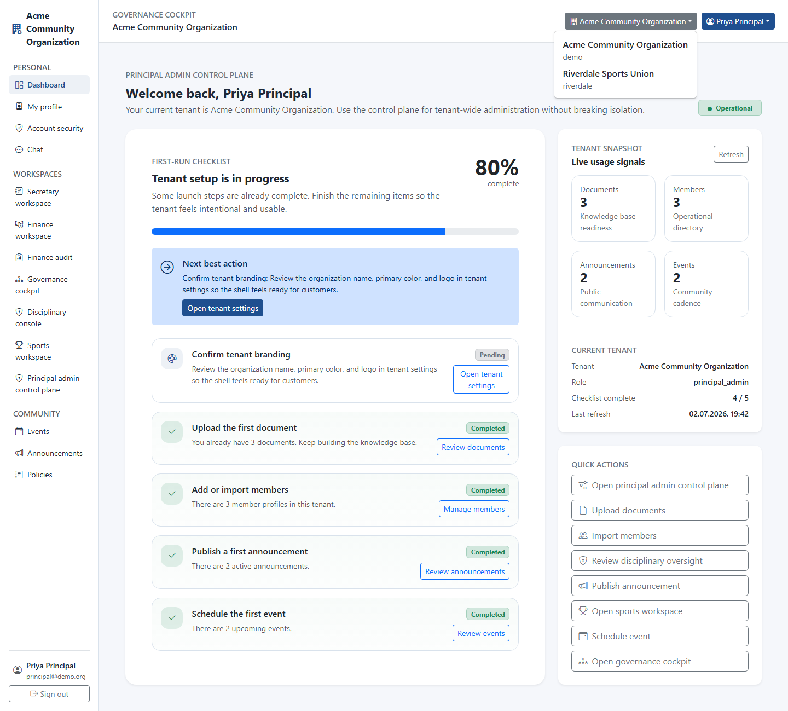

### Secondary Tenant Shell

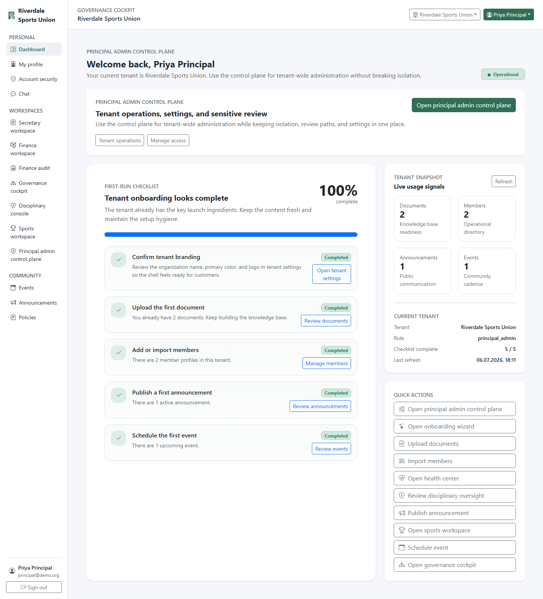

To regenerate the role gallery locally:

```bash
node scripts/capture-readme-gallery.mjs
```

If you already have the frontend running elsewhere, set `KAIRO_DEMO_BASE_URL` first.

To reproduce the live multi-tenant demo stack locally, seed the base tenant first and then run:

```bash
./seed/seed-multi-tenant.sh
```

On Windows PowerShell:

```powershell
.\seed\seed-multi-tenant.ps1
```

## Delivery Status

Kairo is currently a strong professional release candidate for association workflows:

- suitable for controlled pilot deployments and disciplined self-hosting
- technically mature on tenant isolation, backend-enforced permissions, auditability, onboarding, and role-scoped workspaces
- not yet a fully turnkey broad-market product, because the productization track still needs to finish privacy hardening, deployment packaging, and commercial handoff work beyond the current release-candidate scope; the new health center already surfaces recovery evidence and dependency status for operators
- the new onboarding wizard now gives admins a first-run setup path and demo seed guidance, while the productization track still needs to finish privacy/export hardening, deployment packaging, and commercial handoff work beyond the current release-candidate scope

See [`docs/commercial/maturity-review.md`](docs/commercial/maturity-review.md) and [`docs/commercial/demo-to-production-checklist.md`](docs/commercial/demo-to-production-checklist.md).

## Commercial Packaging

If you want to present Kairo as a product rather than only a codebase, start here:

1. [`docs/commercial/README.md`](docs/commercial/README.md) - commercial overview and reading order
2. [`docs/commercial/public-entry.md`](docs/commercial/public-entry.md) - what the public login surface communicates
3. [`docs/commercial/onboarding-guide.md`](docs/commercial/onboarding-guide.md) - customer onboarding flow
4. [`docs/commercial/administrator-guide.md`](docs/commercial/administrator-guide.md) - tenant admin operations
5. [`docs/commercial/support-playbook.md`](docs/commercial/support-playbook.md) - support boundary and incident workflow
6. [`docs/commercial/feature-matrix.md`](docs/commercial/feature-matrix.md) - included modules and future boundaries
7. [`docs/commercial/commercialization-notes.md`](docs/commercial/commercialization-notes.md) - service-led offer structure
8. [`docs/commercial/demo-to-production-checklist.md`](docs/commercial/demo-to-production-checklist.md) - go-live transition checklist
9. [`docs/commercial/professional-release-candidate-checklist.md`](docs/commercial/professional-release-candidate-checklist.md) - final release-candidate validation checklist
10. [`docs/commercial/maturity-review.md`](docs/commercial/maturity-review.md) - remaining legal and business decisions

## Development

```bash
# API tests (SQLite by default — no local PostgreSQL needed)
cd services/api
pip install -r requirements.txt
pytest

# Frontend dev server
cd apps/web
npm install
npm run dev

# With Cloudflare Tunnel (expose to internet)
docker compose --profile tunnel up --build
```

For production deployment with nginx, Cloudflare Tunnel, and backups, see [`docs/deployment-guide.md`](docs/deployment-guide.md).

## Multi-IDE Workflow

This repository can be continued from Codex, Cursor, or GitHub Copilot without losing sprint context.

Read these files at the start of every new AI-assisted session:

1. `constitution/KAIRO_CONSTITUTION.md`
2. `IMPLEMENTATION_ROADMAP.md`
3. `PROJECT_STATUS.md`
4. `prompts/CODEX_AUTOPILOT.md`

Reusable prompts: `prompts/CODEX_AUTOPILOT.md` · `prompts/KAIRO_CONTINUE_UNIVERSAL.md`

## License

MIT
