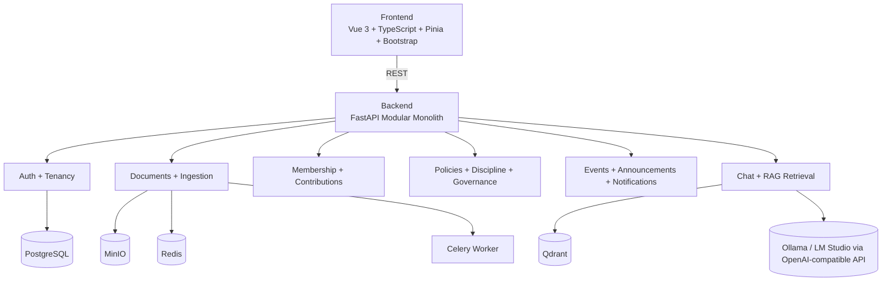
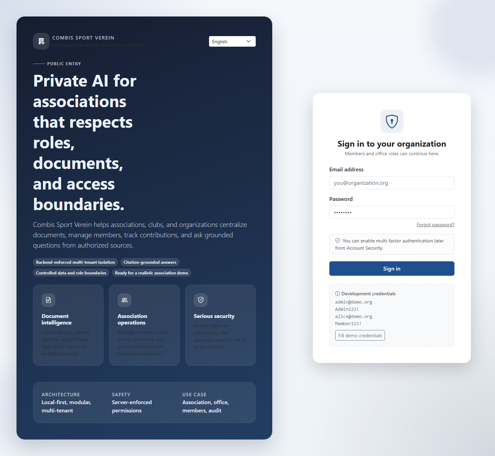
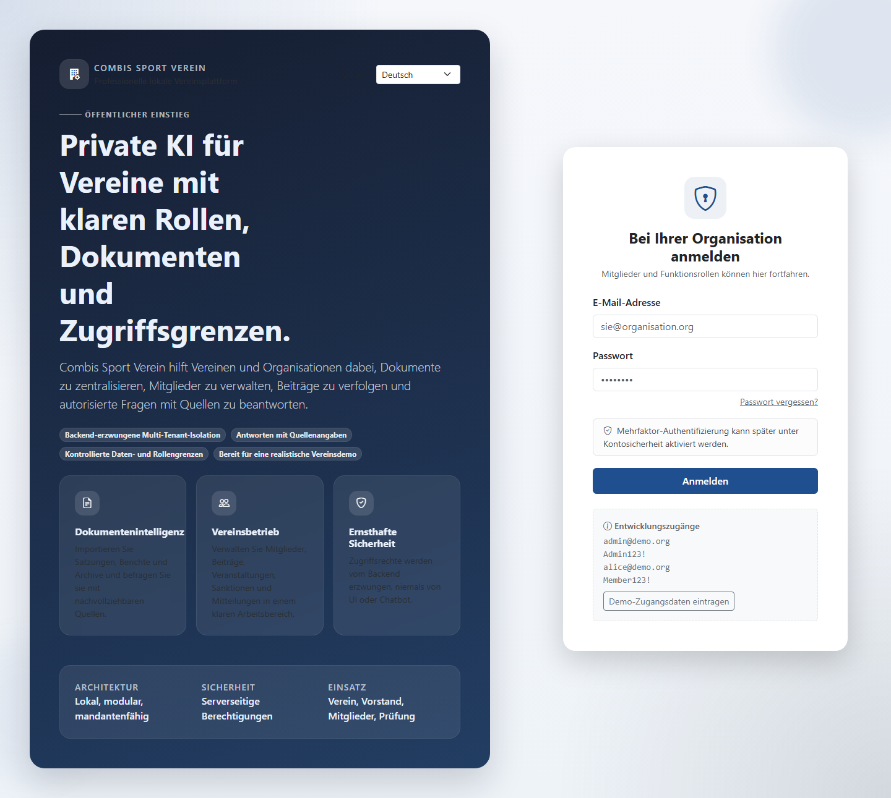
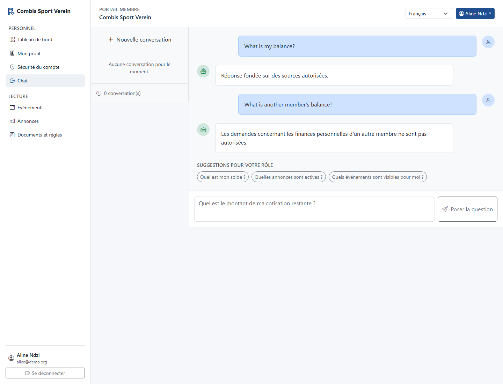
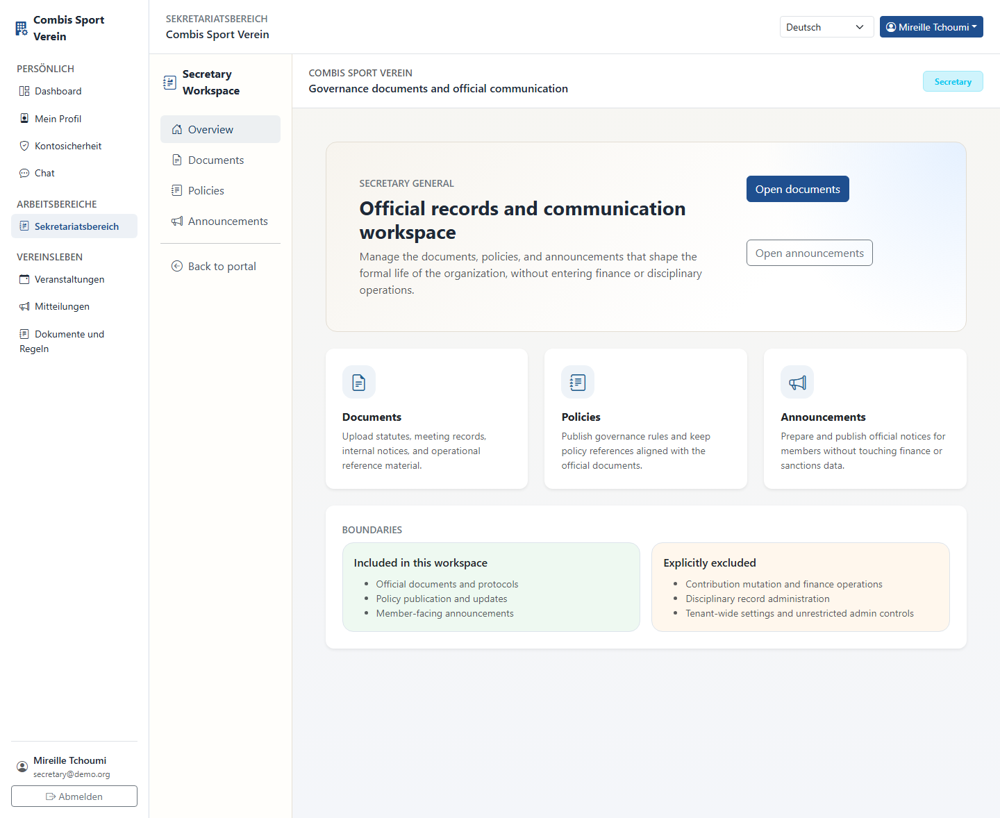
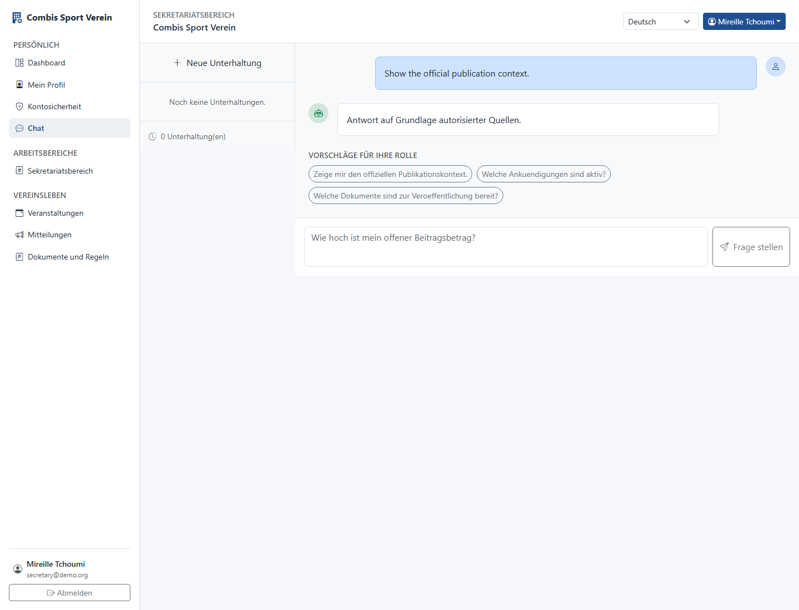
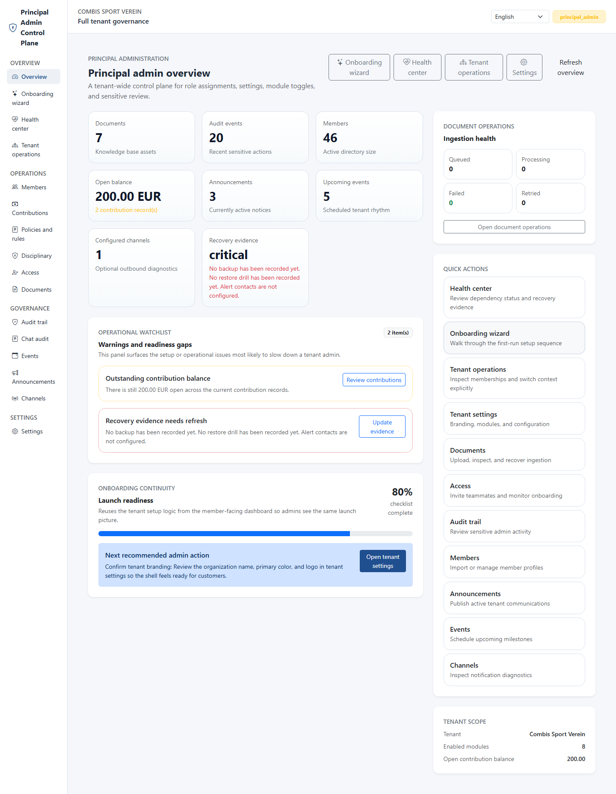
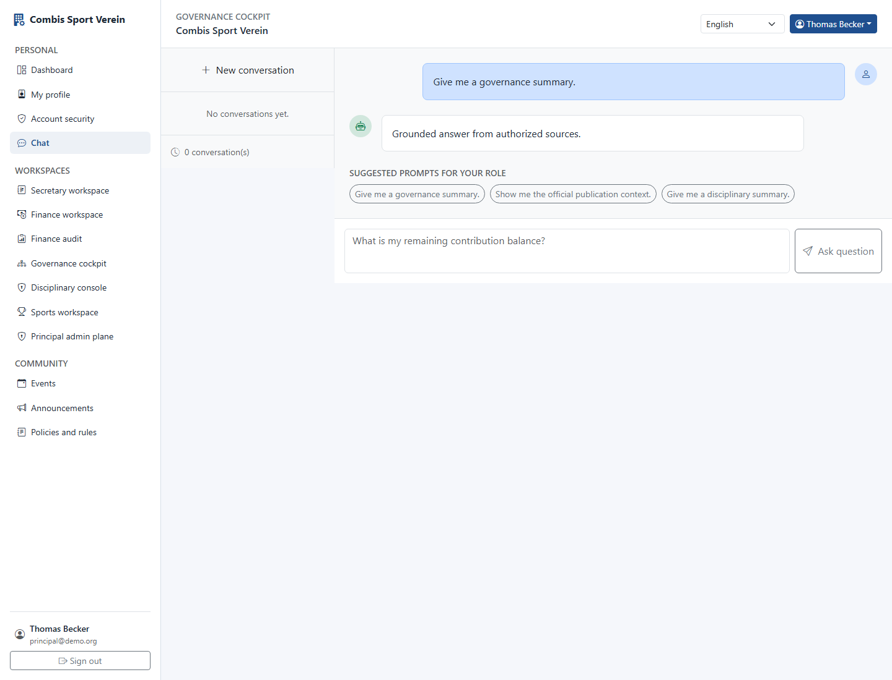

# Kairo — OrgMind AI

A **local-first, multi-tenant RAG platform** for associations, clubs, NGOs, and small businesses.

Upload internal documents, manage members and permissions, and run a private AI assistant that answers questions with source citations — entirely on your own hardware.

## Architecture

```
┌─────────────────────────────────────────────────────┐
│                   Frontend (Vue 3)                   │
│     apps/web/ — Vite · Pinia · Bootstrap 5           │
│     Login · Dashboard · Admin · Member views         │
└──────────────────┬──────────────────────────────────┘
                   │ HTTP (REST API)
┌──────────────────▼──────────────────────────────────┐
│              Backend (FastAPI / Python)              │
│     services/api/ — Modular monolith                 │
│                                                      │
│  ┌──────────┐ ┌──────────┐ ┌────────────────────┐   │
│  │  Auth &  │ │ Document │ │   Membership &     │   │
│  │ Tenancy  │ │   Mgmt   │ │  Contributions     │   │
│  └──────────┘ └──────────┘ └────────────────────┘   │
│  ┌──────────┐ ┌──────────┐ ┌────────────────────┐   │
│  │ Policies │ │  Events  │ │Chat / RAG + Vector │   │
│  │ & Disc.  │ │ & Ann.   │ │ Search & Retrieval │   │
│  └──────────┘ └──────────┘ └────────────────────┘   │
│                                                      │
│  Provider pattern: LLM · Embeddings · Vector Store   │
└───┬──────┬──────┬──────┬──────┬──────┬──────────────┘
    │      │      │      │      │      │
    ▼      ▼      ▼      ▼      ▼      ▼
┌────┐ ┌────┐ ┌────┐ ┌────┐ ┌────┐ ┌────────────┐
│ PG │ │Redis│ │MinIO│ │Qdrant│ │Celery│ │ Ollama     │
└────┘ └────┘ └────┘ └────┘ └────┘ └────────────┘
  DB    Queue   Storage  Vector  Worker  Local LLM
```

### Architecture Diagram (Mermaid)



**Key design decisions:**

- **Backend enforces all permissions** — the LLM never decides access control
- **Tenant isolation** on every DB query (every request carries `tenant_id`)
- **RAG retrieval** is filtered by tenant and access scope before the LLM sees anything
- **Provider pattern** — all infrastructure behind interfaces (swap Ollama or LM Studio OpenAI-compatible endpoints, Qdrant → Pinecone, etc.)
- **Autonomous tests** default to SQLite — portable on any machine or agentic IDE

## Quick Start

```bash
# 1. Prerequisites
#    - Docker & Docker Compose
#    - Git
#    - ~8 GB free RAM (for Ollama or LM Studio + Qdrant + services)

# 2. Clone and enter the repo
git clone <repo-url> kairo
cd kairo

# 3. Copy environment config
cp .env.example .env

# 4. Start all services (first pull may take a few minutes)
docker compose up --build

# 5. In another terminal, seed demo data
docker compose exec api python -m app.db.seed
```

Optional: add a second tenant for multi-tenant demos

```bash
./seed/seed-multi-tenant.sh
```

On Windows PowerShell:

```powershell
.\seed\seed-multi-tenant.ps1
```

Then access the app:

- Frontend: `http://localhost:5173`
- API docs: `http://localhost:8000/docs`

### AI Provider Configuration

Kairo can use either:

- `ollama` for local self-hosted models, or
- an OpenAI-compatible local server such as LM Studio.

To switch to LM Studio, set:

```bash
LLM_PROVIDER_KIND=openai_compatible
EMBEDDING_PROVIDER_KIND=openai_compatible
OPENAI_COMPATIBLE_BASE_URL=http://127.0.0.1:1234/v1
OPENAI_COMPATIBLE_API_KEY=lm-studio
OPENAI_COMPATIBLE_LLM_MODEL=zai-org/glm-4.7-flash
OPENAI_COMPATIBLE_EMBEDDING_MODEL=text-embedding-nomic-embed-text-v1.5
```

Keep the `OLLAMA_*` values if you want to continue using Ollama.

### Demo Credentials

| Role              | Email                     | Password            |
| ----------------- | ------------------------- | ------------------- |
| Admin             | `admin@demo.org`          | `Admin123!`         |
| Member            | `alice@demo.org`          | `Member123!`        |
| Member            | `bob@demo.org`            | `Member123!`        |
| Treasurer         | `treasurer@demo.org`      | `Treasurer123!`     |
| Secretary General | `secretary@demo.org`      | `Secretary123!`     |
| Auditor           | `auditor@demo.org`        | `Auditor123!`       |
| Censor            | `censor@demo.org`         | `Censor123!`        |
| Sports Manager    | `sports@demo.org`         | `Sports123!`        |
| President         | `president@demo.org`      | `President123!`     |
| Vice President    | `vice-president@demo.org` | `VicePresident123!` |
| Principal Admin   | `principal@demo.org`      | `Principal123!`     |

## Project Structure

```
kairo/
├── apps/web/            Vue 3 frontend (TypeScript, Pinia, Bootstrap 5)
├── services/api/        FastAPI backend (modular monolith)
│   ├── app/
│   │   ├── modules/     Domain modules (tenancy, identity, documents, chat,
│   │   │                membership, contributions, policies, disciplinary,
│   │   │                events, announcements)
│   │   ├── db/          Session, migrations, seed scripts
│   │   └── core/        Security, logging, provider abstractions
│   └── tests/           264 integration tests (SQLite, no infra needed)
├── infra/               Infrastructure config samples (nginx, caddy, cloudflare)
├── docs/                Architecture docs, ADRs, sprint notes, deployment guide
├── orgmind_prompt_pack/ Source-of-truth product documentation
├── scripts/             Utility scripts (backup, etc.)
├── seed/                Demo tenant data helpers
├── constitution/        Project constitution and rules
└── prompts/             AI agent startup prompts (Codex, Cursor, Copilot)
```

## Demo Walkthrough

See [`docs/demo-script.md`](docs/demo-script.md) for a complete walkthrough covering:

1. **Admin login** — browse members, manage documents, view policies, configure tenant settings & module toggles
2. **Member login** — view profile, download a personal PDF statement, check balance, and read association updates
3. **RAG chat** — ask questions about bylaws, policies, governance summaries, publication context, and sports or disciplinary role work with cited answers
4. **AI safety** — prompt injection resistance, no-source refusal
5. **Secretary workspace** — manage documents, policies, and announcements without finance powers
6. **Treasurer finance workspace** — review member balances, create contribution records, record payments, and send contribution reminders
7. **Auditor finance oversight** — inspect balances, exports, and payment activity in read-only mode
8. **Censor workspace** — manage disciplinary records inside explicit privacy boundaries
9. **Sports operations workspace** — manage sports events from a dedicated role-scoped surface
10. **Governance cockpit** — review cross-module executive oversight from president and vice president views
11. **Principal admin control plane** — manage tenant-wide settings, access, and high-sensitivity operations
12. **Tenant operations command center** — inspect memberships, review the current tenant posture, and switch context explicitly
13. **Multi-tenant UX** — validate the tenant picker and tenant switcher through the browser gallery harness

## Demo Gallery

The repository includes two reusable browser-driven screenshot packs:

- Seeded full-stack sessions: [`docs/github-demo/sessions/`](docs/github-demo/sessions/)
- Role and tenant gallery: [`docs/github-demo/role-gallery/`](docs/github-demo/role-gallery/)
- Role demo videos (WEBM): [`docs/github-demo/role-videos/`](docs/github-demo/role-videos/)
- Full-stack capture script: [`scripts/capture-github-demo.mjs`](scripts/capture-github-demo.mjs)
- Role-gallery capture script: [`scripts/capture-readme-gallery.mjs`](scripts/capture-readme-gallery.mjs)
- Multi-tenant provisioning helper: [`seed/seed-multi-tenant.sh`](seed/seed-multi-tenant.sh)

The role gallery below is generated from the current application routes and role matrix. It is deterministic and reproducible even when the local demo seed remains single-tenant.

### Public Entry


### Tenant Picker


### Member Portal


### Secretary General


### Treasurer


### Auditor


### Censor


### Sports Manager


### President


### Vice President


### Principal Admin


### Tenant Switcher


### Secondary Tenant Shell


### Live Visual Audit 2026-07-07

The current local build was revalidated against the real demo seed with a SQLite-backed API, role-specific workspaces, and language persistence in French, English, and German.

- Live audit manifests: [`apps/web/artifacts/manual-role-checks/2026-07-07-live-audit/`](apps/web/artifacts/manual-role-checks/2026-07-07-live-audit/)
- Local audit launcher: [`scripts/run_local_demo_backend.py`](scripts/run_local_demo_backend.py)
- Live audit capture script: [`scripts/capture-live-role-audit.mjs`](scripts/capture-live-role-audit.mjs)

#### Language entry points






#### Chat and role checks











## Role Video Gallery

Short role demonstrations are generated in WEBM format and can be opened directly from GitHub.

| Role Surface           | Video                                                                |
| ---------------------- | -------------------------------------------------------------------- |
| Public entry           | [Watch WEBM](docs/github-demo/role-videos/00-public-entry.webm)      |
| Tenant picker          | [Watch WEBM](docs/github-demo/role-videos/01-tenant-picker.webm)     |
| Member portal          | [Watch WEBM](docs/github-demo/role-videos/02-member.webm)            |
| Secretary general      | [Watch WEBM](docs/github-demo/role-videos/03-secretary-general.webm) |
| Treasurer              | [Watch WEBM](docs/github-demo/role-videos/04-treasurer.webm)         |
| Auditor                | [Watch WEBM](docs/github-demo/role-videos/05-auditor.webm)           |
| Censor                 | [Watch WEBM](docs/github-demo/role-videos/06-censor.webm)            |
| Sports manager         | [Watch WEBM](docs/github-demo/role-videos/07-sports-manager.webm)    |
| President              | [Watch WEBM](docs/github-demo/role-videos/08-president.webm)         |
| Vice president         | [Watch WEBM](docs/github-demo/role-videos/09-vice-president.webm)    |
| Principal admin        | [Watch WEBM](docs/github-demo/role-videos/10-principal-admin.webm)   |
| Tenant switcher        | [Watch WEBM](docs/github-demo/role-videos/11-tenant-switcher.webm)   |
| Secondary tenant shell | [Watch WEBM](docs/github-demo/role-videos/12-secondary-tenant.webm)  |

To regenerate the role gallery locally:

```bash
node scripts/capture-readme-gallery.mjs
```

This command now generates both screenshots and short role videos.

If you already have the frontend running elsewhere, set `KAIRO_DEMO_BASE_URL` first.

To reproduce the live multi-tenant demo stack locally, seed the base tenant first and then run:

```bash
./seed/seed-multi-tenant.sh
```

On Windows PowerShell:

```powershell
.\seed\seed-multi-tenant.ps1
```

## Delivery Status

For the current verified sprint state, next sprint, and continuity status, use:

1. [`PROJECT_STATUS.md`](PROJECT_STATUS.md)
2. [`IMPLEMENTATION_ROADMAP.md`](IMPLEMENTATION_ROADMAP.md)
3. [`docs/ai/README.md`](docs/ai/README.md)

This README intentionally avoids repeating a sprint-by-sprint execution status
block because that operational state changes faster than the product overview.

See [`docs/commercial/maturity-review.md`](docs/commercial/maturity-review.md),
[`docs/commercial/demo-to-production-checklist.md`](docs/commercial/demo-to-production-checklist.md),
and [`docs/operations/validation-baseline.md`](docs/operations/validation-baseline.md).

## Commercial Packaging

If you want to present Kairo as a product rather than only a codebase, start here:

1. [`docs/commercial/README.md`](docs/commercial/README.md) - commercial overview and reading order
2. [`docs/commercial/offer-pack.md`](docs/commercial/offer-pack.md) - short product and offer summary
3. [`docs/commercial/buyer-faq.md`](docs/commercial/buyer-faq.md) - simple buyer and board questions
4. [`docs/commercial/public-entry.md`](docs/commercial/public-entry.md) - what the public login surface communicates
5. [`docs/commercial/onboarding-guide.md`](docs/commercial/onboarding-guide.md) - customer onboarding flow
6. [`docs/commercial/administrator-guide.md`](docs/commercial/administrator-guide.md) - tenant admin operations
7. [`docs/commercial/support-playbook.md`](docs/commercial/support-playbook.md) - support boundary and incident workflow
8. [`docs/commercial/feature-matrix.md`](docs/commercial/feature-matrix.md) - included modules and future boundaries
9. [`docs/commercial/commercialization-notes.md`](docs/commercial/commercialization-notes.md) - service-led offer structure
10. [`docs/commercial/demo-to-production-checklist.md`](docs/commercial/demo-to-production-checklist.md) - go-live transition checklist
11. [`docs/commercial/professional-release-candidate-checklist.md`](docs/commercial/professional-release-candidate-checklist.md) - final release-candidate validation checklist
12. [`docs/commercial/maturity-review.md`](docs/commercial/maturity-review.md) - remaining legal and business decisions

## Development

```bash
# Backend quality gates from repository root
pip install -r services/api/requirements.txt
python -m pytest services/api/tests -q
python -m ruff check services/api/app/core/dependencies.py services/api/app/core/security.py services/api/app/core/authorization.py services/api/app/modules/rag/policy.py services/api/tests/conftest.py services/api/tests/test_chat.py services/api/tests/test_governance_roles.py
python -m mypy --config-file services/api/pyproject.toml --explicit-package-bases services/api/app/core/dependencies.py services/api/app/core/security.py services/api/app/core/authorization.py services/api/app/modules/rag/policy.py

# Frontend quality gates
cd apps/web
npm install
npm run type-check
npm run build
npm run test:e2e:locale

# Frontend dev server
npm run dev

# With Cloudflare Tunnel (expose to internet)
docker compose --profile tunnel up --build
```

For production deployment with nginx, Cloudflare Tunnel, and backups, see [`docs/deployment-guide.md`](docs/deployment-guide.md). For the maintained validation command set, see [`docs/operations/validation-baseline.md`](docs/operations/validation-baseline.md).

## Multi-IDE Workflow

This repository can be continued from Codex, Cursor, or GitHub Copilot without losing sprint context.

Read these files at the start of every new AI-assisted session:

1. `constitution/KAIRO_CONSTITUTION.md`
2. `IMPLEMENTATION_ROADMAP.md`
3. `PROJECT_STATUS.md`
4. `prompts/CODEX_AUTOPILOT.md`

Continuity hub: `docs/ai/README.md`

Reusable prompts:

- `prompts/CODEX_AUTOPILOT.md`
- `prompts/KAIRO_CONTINUE_UNIVERSAL.md`
- `prompts/KAIRO_UNIVERSAL_COMPACT.md`

## License

MIT
