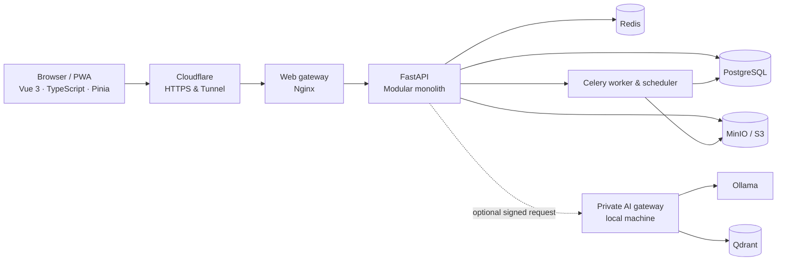
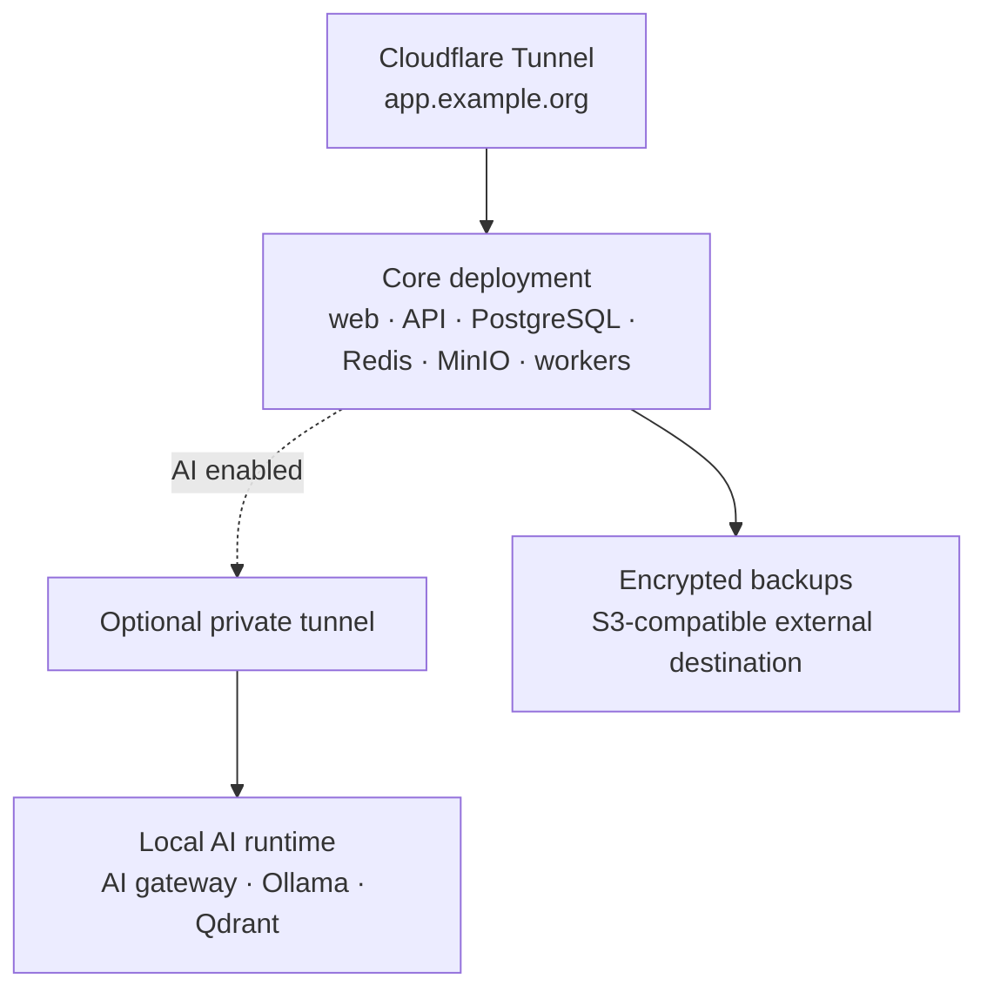
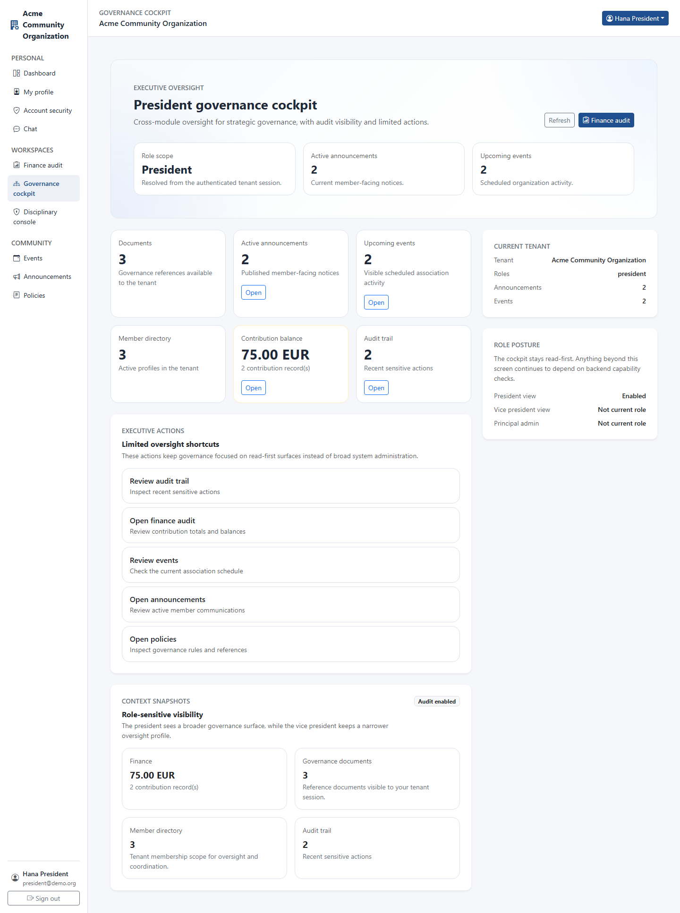
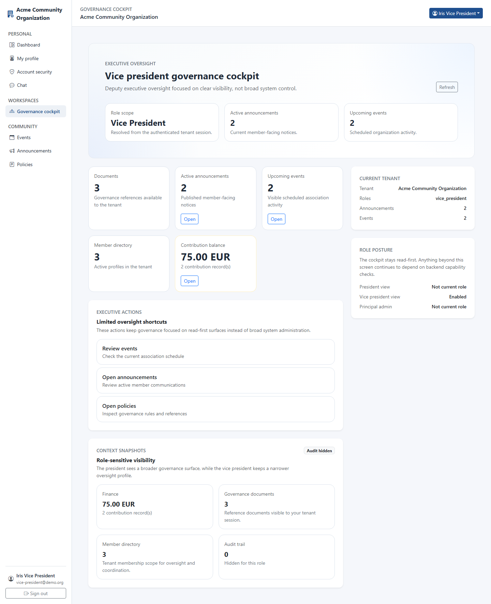
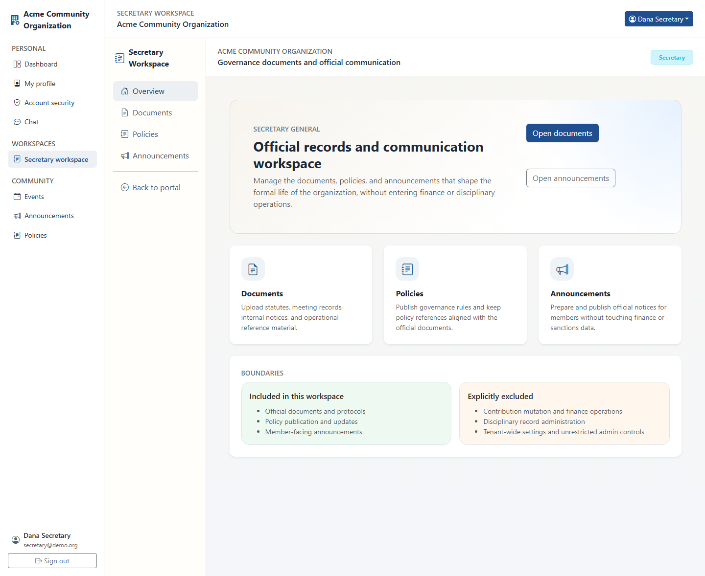
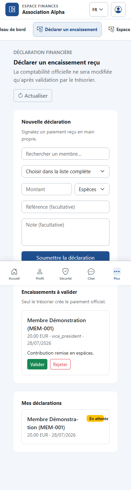
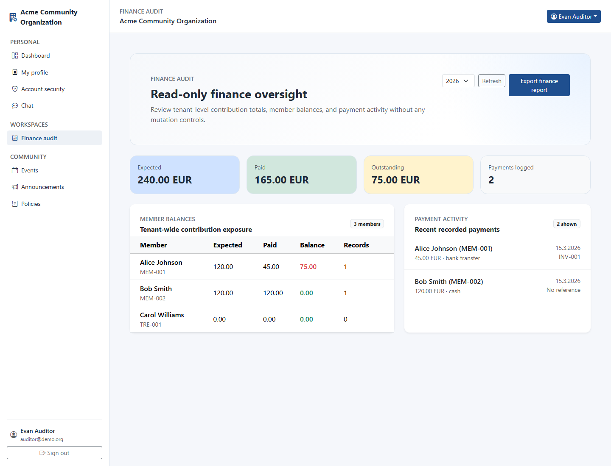
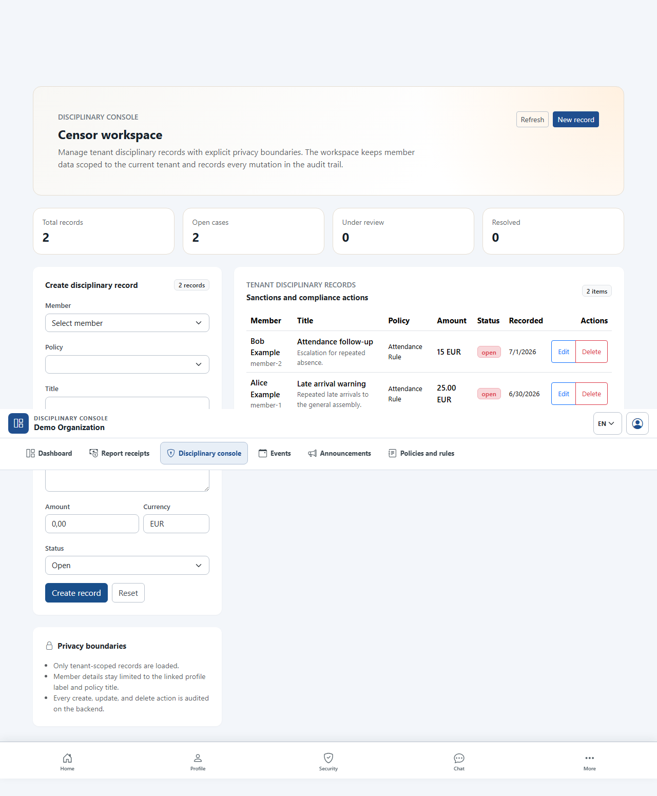
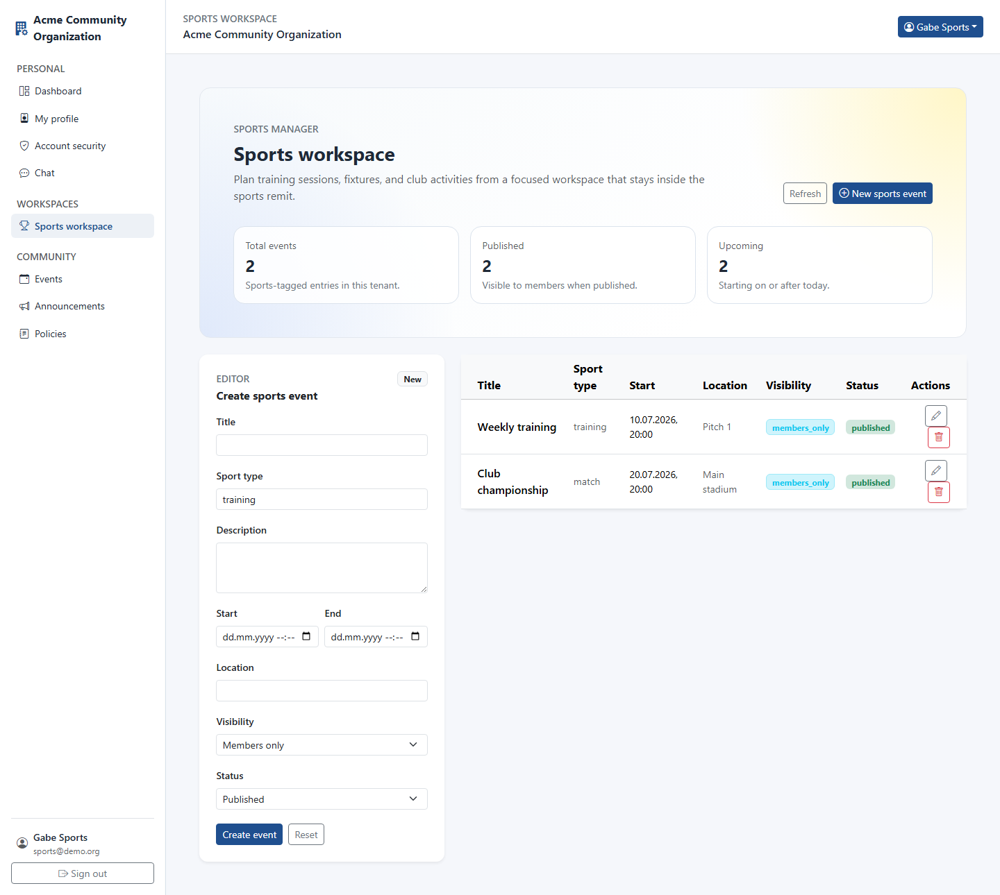
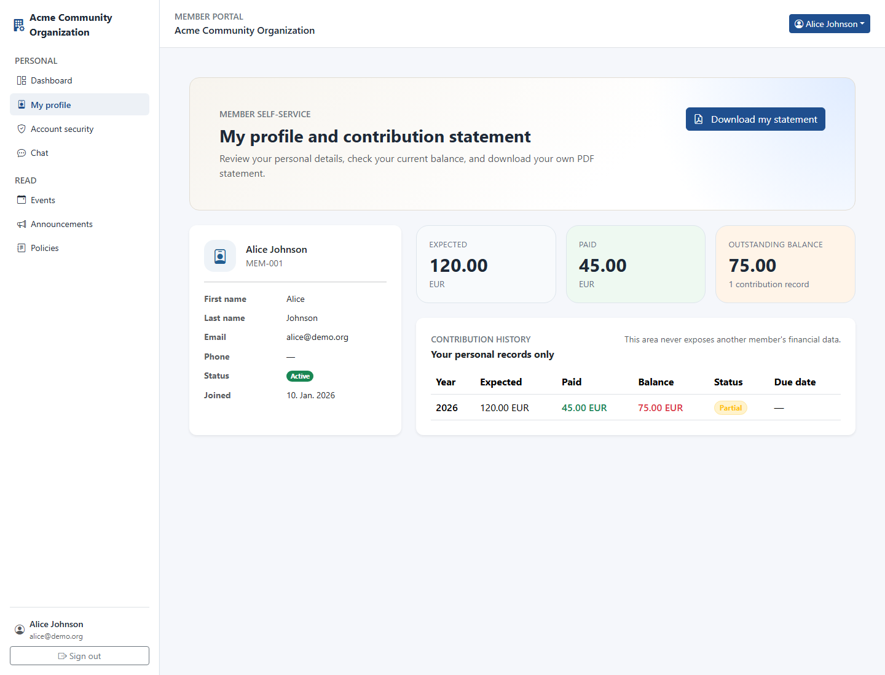

# Kairo

<p align="center">
  <strong>Secure, role-aware operations for associations and community organisations.</strong><br />
  Membership, treasury, governance, discipline, communications, documents and optional private AI — in one responsive platform.
</p>

<p align="center">
  <a href="#quick-start">Quick start</a> ·
  <a href="#architecture">Architecture</a> ·
  <a href="#role-workspaces">Role workspaces</a> ·
  <a href="#documentation">Documentation</a>
</p>

<p align="center">
  
  
  
  
  <a href="LICENSE"></a>
</p>

## What Kairo does

Kairo is a multilingual, multi-tenant application for the day-to-day administration of an association. It keeps sensitive decisions on the server, gives each elected role a focused workspace, and works cleanly on desktop and mobile browsers.

| Area | Included capabilities |
| --- | --- |
| Members | Registration, member search, profiles, lifecycle controls, address and contact records |
| Treasury | Contributions, non-member income, expenses, validation queues, custody tracking, exports and budget views |
| Governance | Role-aware dashboards, documents, policies, announcements, events and an understandable operations journal |
| Discipline | Confidential disciplinary files, sanction history and explicit read/write boundaries |
| Continuity | Encrypted backups, integrity checks, scheduled snapshots, recovery centre and PostgreSQL WAL archiving |
| Notifications | In-app inbox, opt-in Web Push and audited delivery workflow |
| Private AI | Optional local Ollama/Qdrant runtime behind a signed gateway; the cloud core can run without it |

The public pilot is available at [app.combissportverein.org](https://app.combissportverein.org/).

## Architecture


```mermaid
flowchart LR
  Browser["Browser / PWA\nVue 3 · TypeScript · Pinia"] --> Edge["Cloudflare\nHTTPS & Tunnel"]
  Edge --> Web["Web gateway\nNginx"]
  Web --> API["FastAPI\nModular monolith"]

  API --> PG[(PostgreSQL)]
  API --> Redis[(Redis)]
  API --> Storage[(MinIO / S3)]
  API --> Worker["Celery worker & scheduler"]
  Worker --> PG
  Worker --> Storage

  API -. "optional signed request" .-> AIGateway["Private AI gateway\nlocal machine"]
  AIGateway --> Ollama["Ollama"]
  AIGateway --> Qdrant[(Qdrant)]
```

### Deployment modes


```mermaid
flowchart TB
  Core["Core deployment\nweb · API · PostgreSQL · Redis · MinIO · workers"]
  Tunnel["Cloudflare Tunnel\napp.example.org"] --> Core
  Core -. "AI enabled" .-> LocalTunnel["Optional private tunnel"]
  LocalTunnel --> LocalAI["Local AI runtime\nAI gateway · Ollama · Qdrant"]
  Core --> Backup["Encrypted backups\nS3-compatible external destination"]
```

- **Core only:** a complete association platform without chat or local models.
- **Core + local AI:** the private AI runtime remains on a controlled machine; no Ollama or Qdrant port is exposed to the browser.
- **Local development:** a single Docker Compose stack for rapid iteration.

## Security and data boundaries

- Backend-owned authorisation: the client never grants a permission by itself.
- Tenant filtering is applied to every tenant-scoped query.
- The AI retrieval filter is resolved before any context reaches a model.
- Role actions, finance decisions and recovery operations are audit logged.
- Backups are encrypted, signed, SHA-256 verified and restorable in an isolated environment.

## Role workspaces

The association workflow is built around elected roles. The emergency `principal_admin` account is an operational maintenance account, not an association office role.

| Role | Focus |
| --- | --- |
| President | Executive overview, member administration, finance and governance visibility |
| Vice president | Delegated oversight, member visibility and receipt declaration |
| Secretary general | Member administration, documents, policies, announcements and read-only discipline visibility |
| Treasurer | Financial records, receipt validation, custody follow-up, expenses and exports |
| Auditor | Read-only financial oversight and exports |
| Censor | Confidential disciplinary records and sanction management |
| Sports manager | Sports events and programme coordination |
| Ordinary member | Personal profile, contribution status, permitted documents, events and announcements |

<details>
<summary><strong>Visual gallery — current role surfaces</strong></summary>
<br />

<table>
  <tr>
    <td width="50%" valign="top"><strong>President</strong><br /></td>
    <td width="50%" valign="top"><strong>Vice president</strong><br /></td>
  </tr>
  <tr>
    <td valign="top"><strong>Secretary general</strong><br /></td>
    <td valign="top"><strong>Treasurer — mobile validation flow</strong><br /></td>
  </tr>
  <tr>
    <td valign="top"><strong>Auditor</strong><br /></td>
    <td valign="top"><strong>Censor</strong><br /></td>
  </tr>
  <tr>
    <td valign="top"><strong>Sports manager</strong><br /></td>
    <td valign="top"><strong>Ordinary member</strong><br /></td>
  </tr>
</table>

The reproducible capture packs are in [`docs/github-demo/role-gallery/`](docs/github-demo/role-gallery/) and [`apps/web/artifacts/`](apps/web/artifacts/).
</details>

## Quick start

### Local development

Prerequisites: Docker Desktop, Docker Compose and Git.

```powershell
git clone <repository-url> kairo
Set-Location kairo
Copy-Item .env.example .env
docker compose up --build
```

Seed the local demo data in a second terminal:

```powershell
docker compose exec api python -m app.db.seed
```

Then open:

- Web client: [http://localhost:5173](http://localhost:5173)
- API documentation: [http://localhost:8000/docs](http://localhost:8000/docs)

### Core deployment without AI

```powershell
Copy-Item .env.core.example .env.core
docker compose --env-file .env.core -f docker-compose.core.yml up -d --build
```

### Optional private AI runtime

```powershell
Copy-Item .env.ai-local.example .env.ai-local
docker compose --env-file .env.ai-local -f docker-compose.ai-local.yml --profile ai-tunnel up -d --build
```

The AI gateway validates a signed, short-lived server request. When the local runtime is unavailable, Kairo keeps the core platform available and reports the AI state clearly.

## Project layout

```text
kairo/
├── apps/web/                 Vue 3 client and PWA
├── services/api/             FastAPI modular monolith and workers
├── docs/                     Architecture, operations and validation guides
├── scripts/                  Docker, deployment and recovery helpers
├── seed/                     Local demonstration data
├── constitution/             Product and security principles
└── docker-compose*.yml       Local, core and optional-AI deployment modes
```

## Quality checks

```powershell
# Backend
python -m pytest services/api/tests -q

# Frontend
Set-Location apps/web
npm ci
npm run type-check
npm run build
Set-Location ../..
node scripts/check-i18n-coverage.mjs
```

For the maintained validation commands and responsive checks, see [`docs/operations/validation-baseline.md`](docs/operations/validation-baseline.md).

## Documentation

- [Deployment guide](docs/deployment-guide.md)
- [Frontend architecture](docs/FRONTEND_ARCHITECTURE.md)
- [Design system](docs/DESIGN_SYSTEM.md)
- [Responsive test report](docs/RESPONSIVE_TEST_REPORT.md)
- [Encrypted recovery runbook](docs/operations/encrypted-recovery-runbook.md)
- [Project status](PROJECT_STATUS.md)
- [Implementation roadmap](IMPLEMENTATION_ROADMAP.md)
- [Contributing](CONTRIBUTING.md)

## License

Kairo is released under the [MIT License](LICENSE).
