<div align="center">

# Kairo

**Secure, role-aware operations for associations and community organisations.**

Membership · Treasury · Governance · Discipline · Communications · Documents · optional private AI

[**Live portfolio demo →**](https://kairo.patrickdjimgou.dev/demo) &nbsp;·&nbsp;
[Architecture](#architecture) &nbsp;·&nbsp;
[Screenshots](#screenshots) &nbsp;·&nbsp;
[Deployment](#production-deployment-hetzner--cloudflare) &nbsp;·&nbsp;
[Quick start](#quick-start) &nbsp;·&nbsp;
[Documentation](#documentation)

<br />

[](https://github.com/VirgileDjimgou/Kairo/actions/workflows/ci.yml)


[](LICENSE)

</div>


---

## Why Kairo

Community organisations run on a handful of elected volunteers who each need a very
different view of the same data: the treasurer validates money, the secretary keeps
records, the president oversees, and members simply want to know where they stand.

Kairo turns that into one multilingual, multi-tenant platform where **every role sees
exactly what it is allowed to see**, sensitive decisions are enforced on the server, and
the whole thing still feels simple on a phone.

- **Server-owned authorisation** — the client never grants a permission by itself.
- **Role-focused workspaces** — no overwhelming admin console, no accidental data leaks.
- **Money you can audit** — contributions, custody handover, expenses and exports with a
  human-readable operations journal.
- **French-first, three languages** — French, English and German from the first screen.
- **Optional private AI** — a local Ollama/Qdrant assistant that stays behind the API and
  never sees an unauthorised chunk.

## Try it in one click

The public portfolio demo needs no account. Open the demo page, pick a role, and the
matching workspace opens with fictional seed data.

<p align="center">
  <a href="https://kairo.patrickdjimgou.dev/demo"></a>
</p>

| Step | What happens |
| --- | --- |
| 1. Open `/demo` | Public entry point, no sign-up |
| 2. Pick a role | Member, President, Treasurer, Secretary General, Auditor, Censor or Sports Manager |
| 3. Explore | The role workspace opens with a guided three-step tour |
| 4. Switch or exit | The demo banner lets a visitor change role or leave the demo |

> The demo tenant contains fictional data only. Administrative roles are grouped under
> "advanced roles" and are aimed at a guided walkthrough.

### Watch a role walkthrough

Short screen recordings captured from the running application (open a file to play it):

| Journey | Recording | Journey | Recording |
| --- | --- | --- | --- |
| Public demo entry | [▶ play](docs/github-demo/role-videos/00-public-entry.webm) | Tenant picker | [▶ play](docs/github-demo/role-videos/01-tenant-picker.webm) |
| Member portal | [▶ play](docs/github-demo/role-videos/02-member.webm) | Secretary general | [▶ play](docs/github-demo/role-videos/03-secretary-general.webm) |
| Treasurer | [▶ play](docs/github-demo/role-videos/04-treasurer.webm) | Auditor | [▶ play](docs/github-demo/role-videos/05-auditor.webm) |
| Censor | [▶ play](docs/github-demo/role-videos/06-censor.webm) | Sports manager | [▶ play](docs/github-demo/role-videos/07-sports-manager.webm) |
| President | [▶ play](docs/github-demo/role-videos/08-president.webm) | Vice president | [▶ play](docs/github-demo/role-videos/09-vice-president.webm) |
| Principal admin | [▶ play](docs/github-demo/role-videos/10-principal-admin.webm) | Tenant switching | [▶ play](docs/github-demo/role-videos/11-tenant-switcher.webm) |

Demo mode is configured at build time through `apps/web` variables:

| Variable | Default | Purpose |
| --- | --- | --- |
| `VITE_DEMO_MODE` | `true` | Set to `false` to hide `/demo` and the demo banner |
| `VITE_DEMO_TENANT_SLUG` | `demo` | Tenant used by one-click demo sessions |
| `VITE_DEMO_ACCOUNTS` | seed accounts | JSON array overriding the demo account catalogue |

Point `VITE_DEMO_ACCOUNTS` at the instance's real demo credentials when they differ from
the seed (for example after a password rotation), then rebuild the web image. Use the
base64 form `VITE_DEMO_ACCOUNTS_B64` when the passwords contain characters that are
awkward in an env file.

## Screenshots

Every capture below is a real screen from the running application, taken against the
seeded demo tenant in French at desktop and phone widths. The full set (34 captures,
including administration and notifications) is reproducible with the capture script
described at the end of this section.

### Member portal — clarity for everyday members

Members get a read-first portal: their contribution statement, permitted documents,
events and announcements. Nothing more, nothing less.

<table>
  <tr>
    <td width="50%" valign="top"><strong>Personal dashboard</strong><br /></td>
    <td width="50%" valign="top"><strong>Contribution statement &amp; payment history</strong><br /></td>
  </tr>
  <tr>
    <td valign="top"><strong>Events calendar</strong><br /></td>
    <td valign="top"><strong>Optional private assistant</strong><br /></td>
  </tr>
</table>

### Treasurer — money that can be audited

The treasurer workspace turns validated income and recorded expenses into an annual
budget, with one-click Excel, PDF and share-ready exports.

<table>
  <tr>
    <td width="50%" valign="top"><strong>Annual budget &amp; live charts</strong><br /></td>
    <td width="50%" valign="top"><strong>Receipt declaration &amp; validation</strong><br /></td>
  </tr>
</table>

### Secretary general — official records and communication

The secretary manages documents, policies and announcements without touching finance or
discipline.

<table>
  <tr>
    <td width="50%" valign="top"><strong>Records workspace</strong><br /></td>
    <td width="50%" valign="top"><strong>Document management</strong><br /></td>
  </tr>
</table>

### President — executive oversight without overreach

The president gets a cross-module cockpit and full member administration, with a clear
read-only posture for sensitive actions.

<table>
  <tr>
    <td width="50%" valign="top"><strong>Governance cockpit</strong><br /></td>
    <td width="50%" valign="top"><strong>Member administration</strong><br /></td>
  </tr>
  <tr>
    <td valign="top"><strong>Operations journal</strong><br /></td>
    <td valign="top"><strong>Backup &amp; recovery centre</strong><br /></td>
  </tr>
</table>

### Oversight roles — discipline, audit and sport

<table>
  <tr>
    <td width="50%" valign="top"><strong>Auditor — read-only finance</strong><br /></td>
    <td width="50%" valign="top"><strong>Censor — confidential discipline</strong><br /></td>
  </tr>
  <tr>
    <td valign="top"><strong>Sports manager — programme coordination</strong><br /></td>
    <td valign="top"><strong>Account security — MFA &amp; sessions</strong><br /></td>
  </tr>
</table>

### Administration &amp; operations — configuration, health and recovery

The principal administrator configures the tenant (branding, languages, module toggles)
and monitors the platform from a dedicated control plane: dependency health, recovery
evidence, the notification pipeline and the tenant operations command center.

<table>
  <tr>
    <td width="50%" valign="top"><strong>Operational health center</strong><br />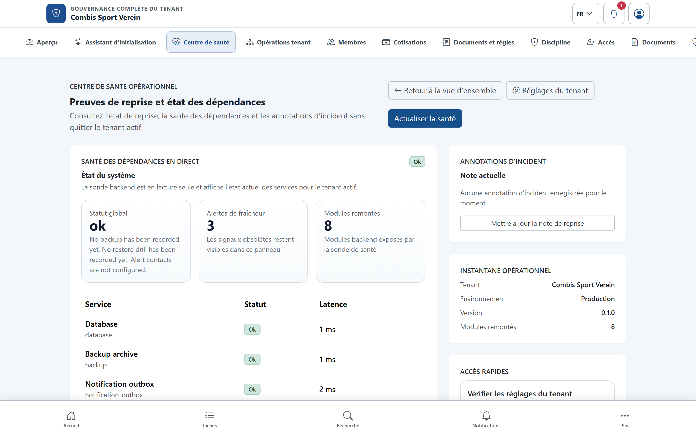</td>
    <td width="50%" valign="top"><strong>Notification operations console</strong><br />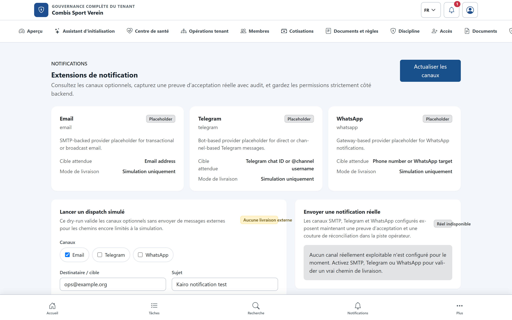</td>
  </tr>
  <tr>
    <td valign="top"><strong>Tenant operations command center</strong><br />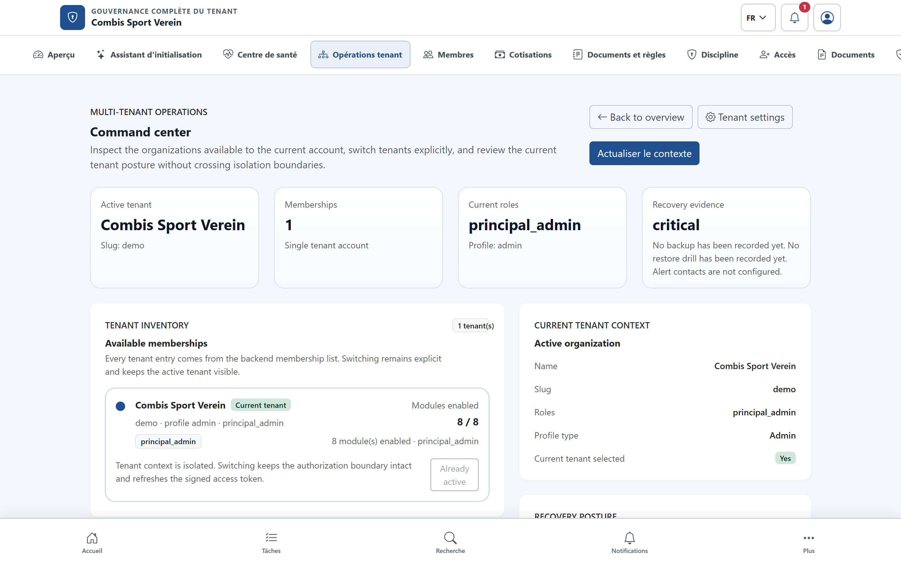</td>
    <td valign="top"><strong>Tenant settings &amp; module toggles</strong><br />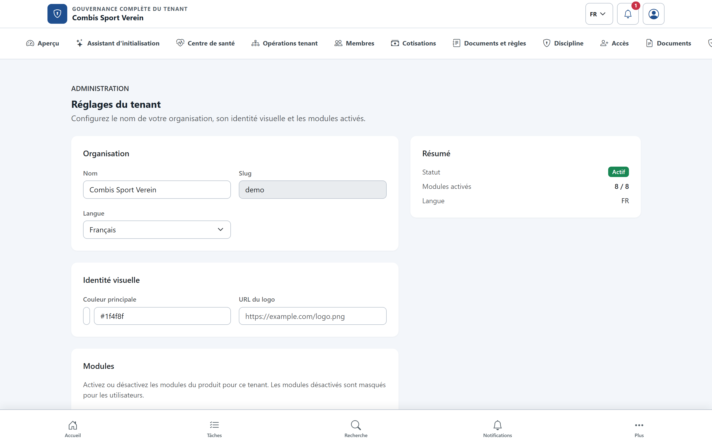</td>
  </tr>
</table>

<details>
<summary><strong>More administration captures (overview and onboarding wizard)</strong></summary>
<br />

<table>
  <tr>
    <td width="50%" valign="top"><strong>Principal admin overview</strong><br />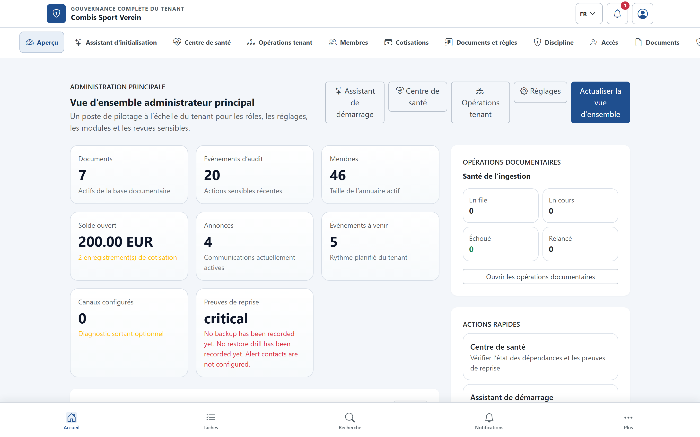</td>
    <td width="50%" valign="top"><strong>First-run onboarding wizard</strong><br />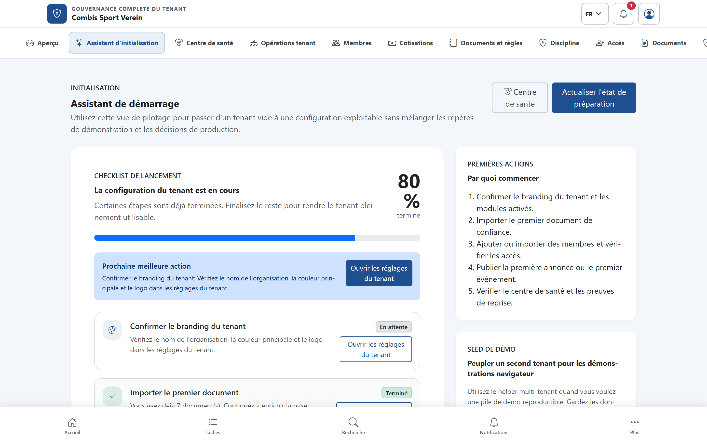</td>
  </tr>
</table>
</details>

### Notifications — durable inbox and delivery pipeline

Notification intents flow through one canonical pipeline: authenticated inbox first,
then opt-in Web Push and Android FCM. Finance and discipline details never leave the
authenticated surface.

<p align="center">
  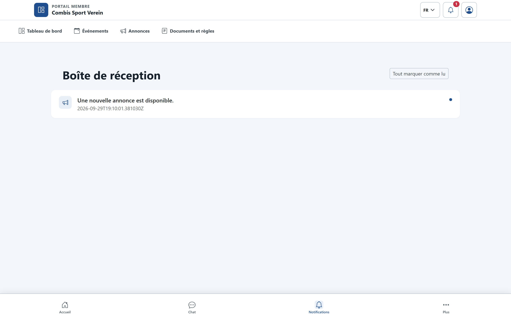
</p>

The operator side (pipeline health, pending/failed counts, channel history) is shown in
the administration section above and documented in the
[notification operator guide](docs/notifications/NOTIFICATION_OPERATOR_GUIDE.md).

### Flutter client — frozen legacy reference

The Flutter application under `apps/flutter_kairo/` is **FROZEN / LEGACY REFERENCE**
(ADR-014): it consumes the same FastAPI contracts, but it receives no new business
features and is not part of the default release pipeline. Its source and the
historical screenshots below are preserved for behavior, notification and parity
reference. Capability continuity is tracked in the
[Flutter → PWA parity matrix](docs/pwa/FLUTTER_TO_PWA_PARITY.md).

<table>
  <tr>
    <td width="25%" valign="top"><strong>Member contributions (historical)</strong><br />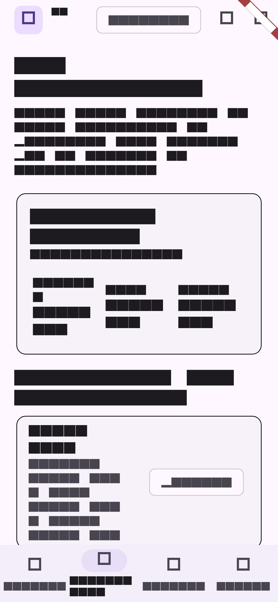</td>
    <td width="25%" valign="top"><strong>Offline draft (historical)</strong><br />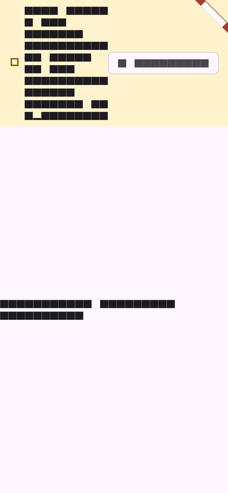</td>
    <td width="25%" valign="top"><strong>Censor discipline (historical)</strong><br />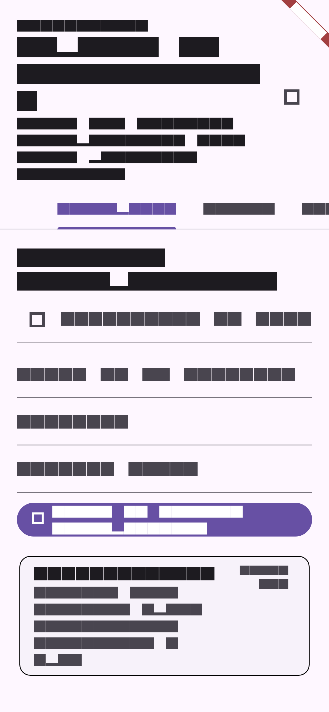</td>
    <td width="25%" valign="top"><strong>Push notification (historical)</strong><br />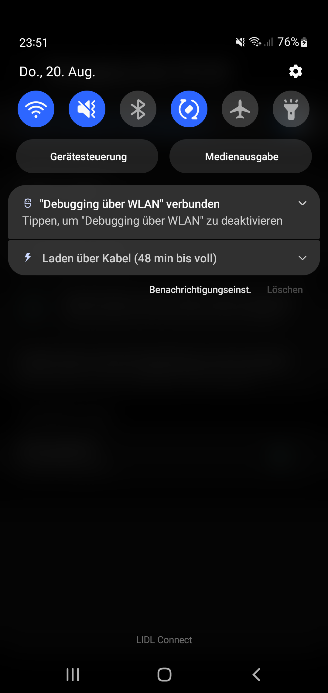</td>
  </tr>
</table>

### Mobile &amp; PWA — installable on a phone

The same surfaces adapt to phone widths with bottom navigation, safe-area handling and an
installable Progressive Web App shell.

<table>
  <tr>
    <td width="20%" valign="top"><strong>Member dashboard</strong><br /></td>
    <td width="20%" valign="top"><strong>Contribution statement</strong><br /></td>
    <td width="20%" valign="top"><strong>Treasury workspace</strong><br /></td>
    <td width="20%" valign="top"><strong>Governance cockpit</strong><br /></td>
    <td width="20%" valign="top"><strong>Admin health center</strong><br />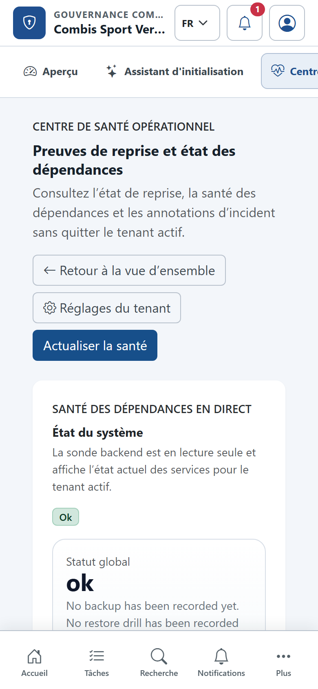</td>
  </tr>
</table>

<details>
<summary><strong>See the full screenshot gallery (sign-in, announcements, tenant shells)</strong></summary>
<br />

<table>
  <tr>
    <td width="50%" valign="top"><strong>Multilingual sign-in</strong><br /></td>
    <td width="50%" valign="top"><strong>Association announcements</strong><br /></td>
  </tr>
</table>

Screenshots are reproducible against any running instance (public demo or local stack)
with `node scripts/capture-readme-screenshots.mjs` and the source manifest lives in
[`docs/screenshots/MANIFEST.md`](docs/screenshots/MANIFEST.md). Override the target with
`KAIRO_SCREENSHOT_BASE_URL`; the script authenticates through the real login contract and
screenshots only API-authorised surfaces.
</details>

## What Kairo does

Kairo is a multilingual, multi-tenant application for the day-to-day administration of an
association. It keeps sensitive decisions on the server, gives each elected role a focused
workspace, and works cleanly on desktop and mobile browsers.

| Area | Included capabilities |
| --- | --- |
| Members | Registration, member search, profiles, lifecycle controls, address and contact records, with optional direct account access |
| Treasury | Contributions, non-member income, expenses, validation queues, cash custody tracking, exports and budget views |
| Governance | Role-aware dashboards, documents, policies, announcements, events and an understandable operations journal |
| Discipline | Confidential disciplinary files, sanction history and explicit read/write boundaries |
| Continuity | Encrypted backups, integrity checks, scheduled snapshots, recovery centre and PostgreSQL WAL archiving |
| Notifications | Durable in-app inbox, preferences, opt-in Web Push and Android FCM through one audited pipeline with operator health |
| Configuration | Tenant branding, languages and per-tenant module toggles; capability-driven navigation from the internal module registry |
| Observability | `/health`, `/health/live`, `/health/ready`, `/metrics`, Grafana package and a committed performance baseline |
| Mobile &amp; PWA | Responsive phone layouts, bottom navigation and an installable Progressive Web App shell |
| Reference client (frozen) | Flutter under `apps/flutter_kairo/` — legacy/reference only, no new business features (ADR-014) |
| Private AI | Optional local Ollama/Qdrant runtime behind a signed gateway; the cloud core can run without it |

## Recent additions (Roadmap V2)

Sprints 100–119 turned the platform into a hardened release candidate and
consolidated it on the Vue 3 PWA. The most visible additions:

- **PWA-first client consolidation** — the Vue 3 PWA is the canonical client; Flutter is frozen as legacy/reference code (ADR-014) and its checks no longer block CI.
- **Capability-driven interface** — `/auth/me` exposes effective capabilities; navigation and actions derive from them, with validated per-tenant role bundles.
- **Module registry and tenant toggles** — every backend module ships a descriptor; `GET /api/v1/modules` returns tenant-filtered navigation metadata, and a disabled module disappears from every client.
- **Notification convergence** — one canonical pipeline with per-user preferences, Web Push + Android FCM transports, invalid-target disabling, bounded retries, an operator pipeline-health console and tested outage recovery.
- **Cash-to-treasury workflow** — a secretary can register a member and declare cash received; the treasurer alone validates it, confirms receipt in treasury, and every transition is journalled and notified through the authenticated inbox.
- **Operational health and performance** — `/health` plus live/ready probes, metrics for both outboxes and backup freshness, a Grafana dashboard package and a committed 200/1000-member performance baseline (`npm run perf:check`).
- **OpenAPI as the client contract** — versioned schema, breaking-change detection, generated TypeScript/Dart types and route-coverage checks in CI.
- **Accessibility and i18n depth** — skip link, WCAG 2.2 AA automated audit pack, reduced-motion support and enforced FR/EN/DE parity.
- **Release hardening** — encrypted signed backups, restore and rollback drills, reproducible production images and upgrade runbooks.

Full evidence: [Sprint 118 release-candidate record](docs/sprint-118-release-candidate-evidence.md) · [Release notes](docs/operations/release-notes-v2.0.0-rc.md) · [Accessibility audit](docs/operations/accessibility-audit.md).

## Features

### Association operations

- Member registration with automatic member codes, structured address, contribution type and optional immediate access.
- Direct member access with a temporary first-login password that must be replaced before normal use.
- Progressive member search by name, surname, member code, phone number or email.
- Read-only member detail panel with authorised contribution and disciplinary history.
- Member lifecycle controls: edit, pause, reactivate and, for authorised roles, delete.
- Assisted access recovery for the president, vice president, secretary general and principal administrator, with a time-limited one-time password, forced replacement and session revocation.
- Events, announcements, governance documents and policy management.

### Treasury and accountability

- Individual and family contributions, partial payments and member balance statements.
- Receipt declarations for contributions, donations, sponsorships, tournament income and other revenue.
- Treasurer-only validation, rejection with reason, custody handover follow-up, final treasury-receipt confirmation and configurable reminders.
- Treasurer-only expense recording with categorised annual budget impact.
- Finance audit workspace, operations journal and exports to Excel, PDF and WhatsApp-ready summaries.
- Responsive budget charts separating income sources from expenditure categories.

### Governance and discipline

- Dedicated workspaces for the president, vice president, secretary general, treasurer, auditor, censor and sports manager.
- Explicit server-enforced read/write boundaries for confidential disciplinary records.
- Complete sanction records: member, policy, circumstances, amount, status, dates and auditable changes.
- Human-readable operations journal with actor identity, role, result and action details.

### Experience and notifications

- French-first interface with English and German alternatives.
- Responsive desktop and mobile layouts, bottom navigation and installable PWA support.
- Accessible confirmation, warning and error notifications with field-level validation feedback.
- Tenant-isolated inbox, per-user preferences, opt-in Web Push and Android FCM with audited delivery outcomes.
- Push payloads are deliberately generic; finance and disciplinary detail stays behind authentication.
- Android FCM opens an allowlisted in-app destination; financial alerts are delivered with high Android priority when the app is in the background.
- Operator pipeline health (`/notifications/health`) with pending/failed counts and disabled-target visibility.

### Reliability and privacy

- Multi-tenant isolation and backend-owned capability checks; tenant module toggles remove whole features from every client.
- Optional private AI assistant with tenant- and scope-filtered retrieval.
- Core deployment can run without the local AI machine.
- Encrypted, signed and SHA-256 verified backups, daily scheduling, WAL archiving and isolated restore procedures.
- Health probes (`/health`, `/health/live`, `/health/ready`), metrics for outboxes and backup freshness, and a committed performance baseline.
- Versioned OpenAPI schema with breaking-change detection and drift-checked generated clients.
- Automated accessibility audit (WCAG 2.2 AA target) and enforced FR/EN/DE translation parity in CI.

## Architecture

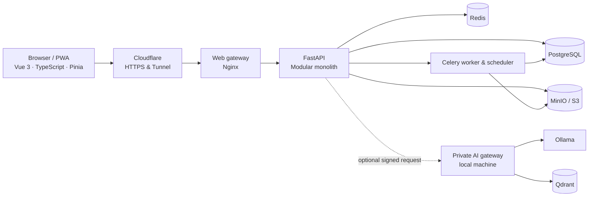
```mermaid
flowchart LR
  Browser["Browser / PWA\nVue 3 · TypeScript · Pinia"] --> Edge["Cloudflare\nHTTPS & Tunnel"]
  Edge --> Web["Web gateway\nNginx"]
  Web --> API["FastAPI\nModular monolith"]

  API --> PG[(PostgreSQL)]
  API --> Redis[(Redis)]
  API --> Storage[(MinIO / S3)]
  API --> Worker["Celery worker & scheduler"]
  Worker --> PG
  Worker --> Storage

  API -. "optional signed request" .-> AIGateway["Private AI gateway\nlocal machine"]
  AIGateway --> Ollama["Ollama"]
  AIGateway --> Qdrant[(Qdrant)]
```

The backend is a **modular monolith**: thin routers, service orchestration and isolated
repositories. Every tenant-scoped query carries `tenant_id`, and retrieval filtering runs
*before* any context reaches a model.

### Deployment modes

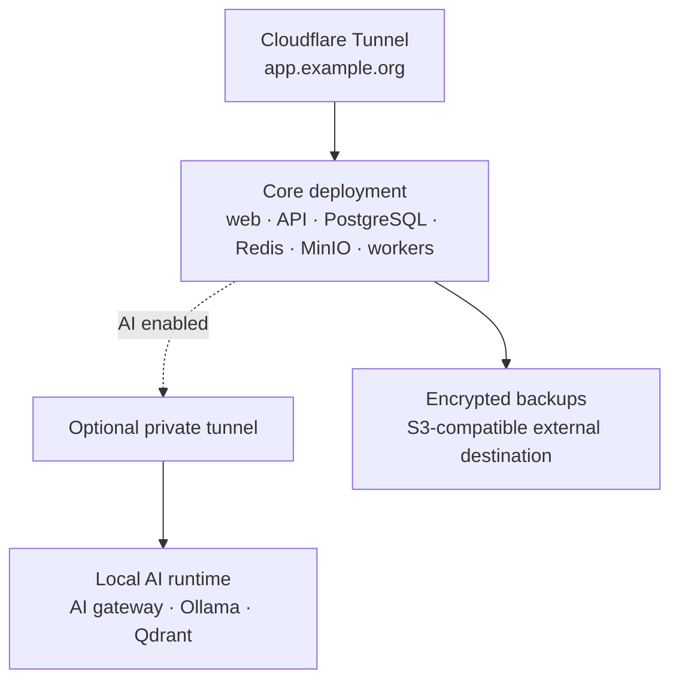
```mermaid
flowchart TB
  Core["Core deployment\nweb · API · PostgreSQL · Redis · MinIO · workers"]
  Tunnel["Cloudflare Tunnel\napp.example.org"] --> Core
  Core -. "AI enabled" .-> LocalTunnel["Optional private tunnel"]
  LocalTunnel --> LocalAI["Local AI runtime\nAI gateway · Ollama · Qdrant"]
  Core --> Backup["Encrypted backups\nS3-compatible external destination"]
```

- **Core only:** a complete association platform without chat or local models.
- **Core + local AI:** the private AI runtime remains on a controlled machine; no Ollama or Qdrant port is exposed to the browser.
- **Local development:** a single Docker Compose stack for rapid iteration.

### Production deployment (Hetzner + Cloudflare)

The reference production deployment runs the core stack on a Hetzner host and uses a
dedicated Cloudflare Tunnel as the only ingress. No application port is published on the
host; PostgreSQL, Redis, MinIO and the workers stay on the private Docker network.

| Item | Value |
| --- | --- |
| Host release path | `/home/kairo/kairo-release` |
| Compose project / file | `kairo` / `docker-compose.core.yml` |
| Environment file | `.env.core` (mode `0600`, never committed) |
| Public ingress | Cloudflare Tunnel `kairo-portfolio` → `http://web:80` |
| Public hostnames | portfolio demo (`kairo.patrickdjimgou.dev`) and association deployment (`app.combissportverein.org`) |
| Deploy / rollback helpers | `scripts/deploy_core_release.sh`, `scripts/rollback_release.sh`, `scripts/production_smoke.sh` |

Key configuration variables (values live only in the ignored environment file):

| Variable | Purpose |
| --- | --- |
| `APP_BASE_URL`, `CORS_ORIGINS` | Public HTTPS URL and allowed browser origin |
| `CLOUDFLARE_TUNNEL_TOKEN` | Cloudflare Tunnel credential for the host |
| `JWT_SECRET_KEY` | Session signing key (rotate after any suspected exposure) |
| `POSTGRES_*`, `REDIS_URL` | Private data services |
| `MINIO_ROOT_*`, `MINIO_BUCKET_DOCUMENTS` | Document object storage |
| `BACKUP_ENCRYPTION_KEY`, `BACKUP_MANIFEST_SIGNING_KEY` | Encrypted, signed recovery archives |
| `SMTP_*`, `TELEGRAM_*`, `WHATSAPP_*` | Optional identity and operator delivery channels |
| `WEB_PUSH_*`, `FIREBASE_*` | Optional push transports (Web Push VAPID, Android FCM) |
| `VITE_API_BASE_URL`, `VITE_DEMO_MODE` | Web build inputs (same-origin `/api/v1`) |

**Secret policy:** SSH keys, Cloudflare tokens, database passwords and JWT secrets are
never committed. They are kept in the operator's local, git-ignored files
(`.env.core`, `.env.production.local`) and in the operator's SSH configuration; the
repository only ships `.env.*.example` templates. CI enforces this with the sensitive-file
scanner and a gitleaks history scan.

```powershell
# Upgrade with a mandatory pre-migration safety backup, then verify
bash scripts/deploy_core_release.sh upgrade
docker compose --env-file .env.core -f docker-compose.core.yml exec -T api alembic current
```

Operator runbooks: [Hetzner portfolio runbook](docs/operations/hetzner-portfolio-runbook.md) ·
[Deployment runbook](docs/operations/deployment-runbook.md) ·
[Encrypted recovery runbook](docs/operations/encrypted-recovery-runbook.md).

## Tech stack

| Layer | Technology |
| --- | --- |
| Web client | Vue 3, TypeScript, Pinia, Vue Router, Vite, Bootstrap, PWA |
| Reference client (frozen) | Flutter under `apps/flutter_kairo/` — legacy/reference only (ADR-014) |
| API | Python 3.12, FastAPI, SQLAlchemy, Pydantic, Alembic |
| Data & jobs | PostgreSQL, Redis, Celery worker and scheduler |
| Object storage | MinIO / S3-compatible |
| Private AI (optional) | Signed AI gateway, Ollama, Qdrant |
| Delivery | Docker Compose, Nginx, Cloudflare Tunnel |
| Quality | pytest, ruff, mypy, vue-tsc, Playwright, gitleaks, GitHub Actions (Flutter checks optional/manual) |

## Security and data boundaries

- Backend-owned authorisation: the client never grants a permission by itself.
- Tenant filtering is applied to every tenant-scoped query.
- The AI retrieval filter is resolved before any context reaches a model.
- Role actions, finance decisions and recovery operations are audit logged.
- Backups are encrypted, signed, SHA-256 verified and restorable in an isolated environment.
- CI runs a secret scanner and rejects committed databases, backups and sensitive exports.

## Role workspaces

The association workflow is built around elected roles. The emergency `principal_admin`
account is an operational maintenance account, not an association office role.

| Role | Focus |
| --- | --- |
| President | Executive overview, member administration, finance and governance visibility |
| Vice president | Delegated oversight, member visibility and receipt declaration |
| Secretary general | Member administration, documents, policies, announcements and read-only discipline visibility |
| Treasurer | Financial records, receipt validation, custody follow-up, expenses and exports |
| Auditor | Read-only financial oversight and exports |
| Censor | Confidential disciplinary records and sanction management |
| Sports manager | Sports events and programme coordination |
| Ordinary member | Personal profile, contribution status, permitted documents, events and announcements |

## Quick start

### Local development

Prerequisites: Docker Desktop, Docker Compose and Git.

```powershell
git clone https://github.com/VirgileDjimgou/Kairo.git kairo
Set-Location kairo
Copy-Item .env.example .env
docker compose up --build
```

Seed the local demo data in a second terminal:

```powershell
docker compose exec api python -m app.db.seed
```

Then open:

- Web client: [http://localhost:5173](http://localhost:5173)
- API documentation: [http://localhost:8000/docs](http://localhost:8000/docs)

### Core deployment without AI

```powershell
Copy-Item .env.core.example .env.core
docker compose --env-file .env.core -f docker-compose.core.yml up -d --build
```

### Optional private AI runtime

```powershell
Copy-Item .env.ai-local.example .env.ai-local
docker compose --env-file .env.ai-local -f docker-compose.ai-local.yml --profile ai-tunnel up -d --build
```

The AI gateway validates a signed, short-lived server request. When the local runtime is
unavailable, Kairo keeps the core platform available and reports the AI state clearly.

## Project layout

```text
kairo/
├── apps/web/                 Vue 3 client and PWA (canonical client)
├── apps/flutter_kairo/       Flutter client (frozen legacy reference, ADR-014)
├── services/api/             FastAPI modular monolith and workers
├── docs/                     Architecture, operations and validation guides
├── scripts/                  Docker, deployment and recovery helpers
├── seed/                     Local demonstration data
├── constitution/             Product and security principles
└── docker-compose*.yml       Local, core and optional-AI deployment modes
```

## Quality checks

```powershell
# Backend
python -m pytest services/api/tests -q
python -m ruff check services/api/app/ services/api/tests/
python -m mypy --config-file services/api/pyproject.toml --explicit-package-bases services/api/app/

# Frontend
Set-Location apps/web
npm ci
npm run type-check
npm run build
npm run test:e2e:locale
npm run test:e2e:roles
npm run test:e2e:release-candidate
npm run test:e2e:a11y
Set-Location ../..

# Flutter client — optional/manual reference checks only (frozen, ADR-014)
# Run the manual "Flutter Legacy Reference" GitHub workflow instead of blocking CI.
Set-Location apps/flutter_kairo
flutter analyze
flutter test
Set-Location ../..

# Contracts and performance (repository root)
npm run contracts:check
npm run perf:check

# Repository guards
node scripts/check-sensitive-files.mjs
node scripts/check-i18n-parity.mjs
node scripts/check-i18n-coverage.mjs
node scripts/check-api-collection-paths.mjs
node scripts/check-capability-bundles.mjs
```

For the maintained validation commands and responsive checks, see [`docs/operations/validation-baseline.md`](docs/operations/validation-baseline.md).

## Project status and roadmap

Kairo is an active portfolio project. The Vue 3 PWA is the canonical, supported
client (ADR-014); the Flutter Android/Web client is frozen as legacy/reference code,
consumes the same API contracts, and receives no new business features during
S119–S128.

- **Roadmap V2 (Sprints 100–118) — complete.** Release-candidate gates are green: 362 API tests, four browser packs, contracts and repository guards. See the [release-candidate evidence](docs/sprint-118-release-candidate-evidence.md) and [release notes](docs/operations/release-notes-v2.0.0-rc.md).
- **Roadmap V2 (Sprints 119–128) — active: PWA-first, white-label SaaS.** Client consolidation, unified PWA Service Worker, Web Push/FCM installations, actionable deep links, tenant branding, tenant domains, outbox reliability, reproducible CI and the real full-stack COMBIS pilot. See [`docs/roadmap/KAIRO_V2_ROADMAP.md`](docs/roadmap/KAIRO_V2_ROADMAP.md).
- Vue 3 PWA — canonical client.
- Flutter client — frozen legacy/reference source; not a release target.
- iOS and desktop — no release commitment; tracked only as Flutter reference history.

See [`PROJECT_STATUS.md`](PROJECT_STATUS.md), [`docs/ai/PROJECT_STATE.md`](docs/ai/PROJECT_STATE.md) and
[`docs/pwa/FLUTTER_TO_PWA_PARITY.md`](docs/pwa/FLUTTER_TO_PWA_PARITY.md) for the current state.

## Documentation

- [Deployment guide](docs/deployment-guide.md)
- [Hetzner portfolio runbook](docs/operations/hetzner-portfolio-runbook.md)
- [Deployment &amp; rollback runbook](docs/operations/deployment-runbook.md)
- [Encrypted recovery runbook](docs/operations/encrypted-recovery-runbook.md)
- [Notification operator guide](docs/notifications/NOTIFICATION_OPERATOR_GUIDE.md)
- [Accessibility audit](docs/operations/accessibility-audit.md)
- [Validation baseline](docs/operations/validation-baseline.md)
- [Frontend architecture](docs/FRONTEND_ARCHITECTURE.md)
- [Design system](docs/DESIGN_SYSTEM.md)
- [Flutter → PWA parity matrix](docs/pwa/FLUTTER_TO_PWA_PARITY.md)
- [Flutter client roadmap (frozen, historical)](docs/flutter/FLUTTER_APP_ROADMAP.md)
- [Flutter feature parity matrix (frozen, historical)](docs/flutter/FEATURE_PARITY.md)
- [Project status](PROJECT_STATUS.md)
- [Roadmap V2 (active)](docs/roadmap/KAIRO_V2_ROADMAP.md)
- [Roadmap V3 (draft, not active)](docs/roadmap/KAIRO_V3_ROADMAP.md)
- [Contributing](CONTRIBUTING.md)

## License

Kairo is released under the [MIT License](LICENSE).

<div align="center">
<br />
If this project is useful or interesting, a ⭐ on GitHub is appreciated.
</div>
