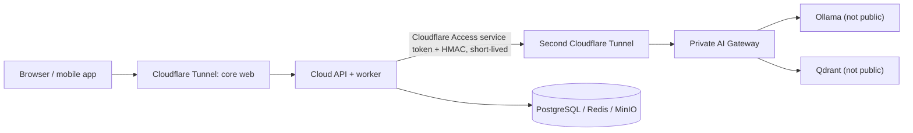

# Remote AI Runtime (cloud core + local AI machine)

This deployment keeps the association application in the cloud while running Ollama and Qdrant only on a private local machine. The browser always calls the cloud API; it never reaches Ollama, Qdrant, or the AI gateway directly.



## The three modes

| Mode | Core configuration | Result |
| --- | --- | --- |
| Disabled | `AI_RUNTIME_MODE=disabled` | Chat returns **Assistant IA désactivé par l’association**. Documents remain available and ingestion jobs wait safely. |
| Embedded | `AI_RUNTIME_MODE=embedded` | The legacy all-in-one Compose deployment still uses local Ollama/Qdrant. |
| Remote | `AI_RUNTIME_MODE=remote`, both provider kinds `remote_ai_runtime` | Cloud API uses the private local runtime through the AI gateway. |

## One-time setup

1. Generate a long random shared secret once. On Windows PowerShell:

   ```powershell
   [Convert]::ToBase64String((1..48 | ForEach-Object { Get-Random -Maximum 256 }))
   ```

2. On the cloud server, copy `.env.core.example` to `.env.core`, set real passwords/secrets, the generated `AI_GATEWAY_SHARED_SECRET`, and the private AI hostname such as `https://ai-runtime.example.org`.
3. On the local AI machine, copy `.env.ai-local.example` to `.env.ai-local` and set the *same* shared secret. Set exactly the same embedding model/profile and `EMBEDDING_DIMENSIONS` as in `.env.core`.
4. Create a **second**, dedicated Cloudflare Tunnel whose public hostname routes only to `http://ai-gateway:8081`. Do not route Ollama or Qdrant.
5. Protect this hostname with Cloudflare Access. Create an Access service token permitted only for that application, then put its client ID and secret in `AI_GATEWAY_ACCESS_CLIENT_ID` and `AI_GATEWAY_ACCESS_CLIENT_SECRET` on the cloud core. The gateway additionally rejects unsigned, expired, or replayed HMAC requests.

## Start the cloud core

```powershell
Copy-Item .env.core.example .env.core
# Edit .env.core before continuing.
docker compose --env-file .env.core -f docker-compose.core.yml up -d --build
docker compose --env-file .env.core -f docker-compose.core.yml --profile tunnel up -d
```

The core application is available locally on `http://localhost:8080`; its normal public address remains the hostname configured on the core Cloudflare Tunnel.

## Start the local AI machine

```powershell
Copy-Item .env.ai-local.example .env.ai-local
# Edit .env.ai-local before continuing.
docker compose --env-file .env.ai-local -f docker-compose.ai-local.yml up -d --build
docker compose --env-file .env.ai-local -f docker-compose.ai-local.yml exec ollama ollama pull qwen2.5:7b-instruct
docker compose --env-file .env.ai-local -f docker-compose.ai-local.yml exec ollama ollama pull nomic-embed-text
docker compose --env-file .env.ai-local -f docker-compose.ai-local.yml --profile ai-tunnel up -d
```

To stop only the optional AI runtime, run:

```powershell
docker compose --env-file .env.ai-local -f docker-compose.ai-local.yml down
```

The association keeps working. Chat reports **Assistant IA temporairement indisponible** and new document jobs move to `awaiting_ai`; the cloud scheduler retries them every minute when the AI machine returns.

## Change embedding model or dimensions deliberately

Changing either the embedding profile/model or the vector dimension is a breaking index change. The gateway rejects a mismatched existing collection rather than mixing incompatible vectors. Reindex intentionally:

```powershell
docker compose --env-file .env.ai-local -f docker-compose.ai-local.yml down
# Keep the Qdrant volume for routine restarts. Remove/recreate it only after a backup and only when an intentional full reindex is planned.
docker compose --env-file .env.ai-local -f docker-compose.ai-local.yml up -d
```

Then trigger the application's documented document reindex workflow. The embedding sentinel records the model identity, provider, and dimensions so the change is visible in the cloud worker logs.

## Operational checks

```powershell
docker compose --env-file .env.core -f docker-compose.core.yml ps
docker compose --env-file .env.ai-local -f docker-compose.ai-local.yml ps
docker compose --env-file .env.core -f docker-compose.core.yml logs --tail=100 api worker scheduler
docker compose --env-file .env.ai-local -f docker-compose.ai-local.yml logs --tail=100 ai-gateway
```

Do not expose ports `11434`, `6333`, `6334`, or `8081` through a firewall, router, or Cloudflare public hostname. Only the Access-protected second tunnel may reach the AI gateway; the cloud API remains the policy and tenant-isolation authority.
